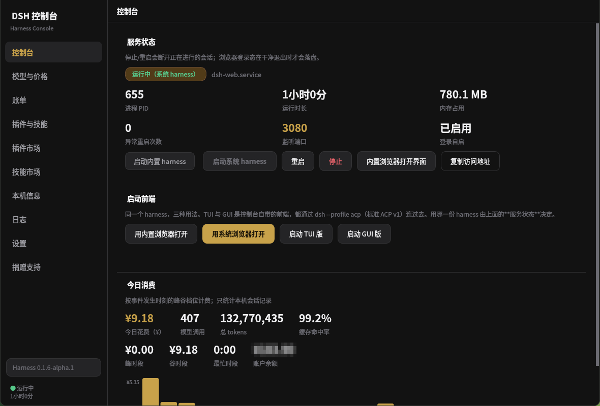
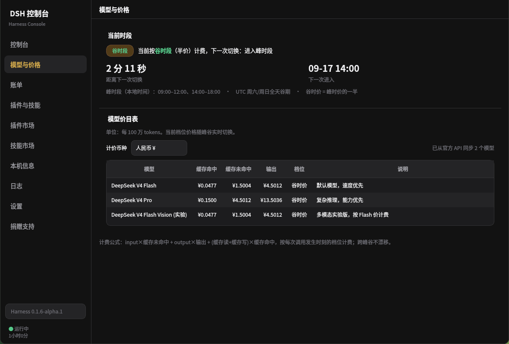
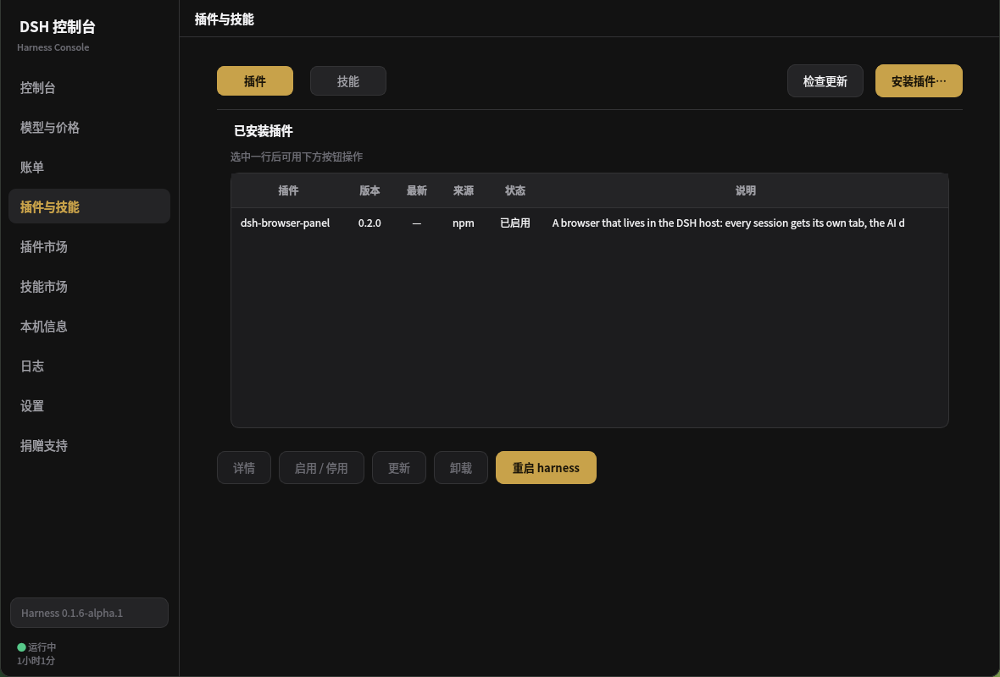
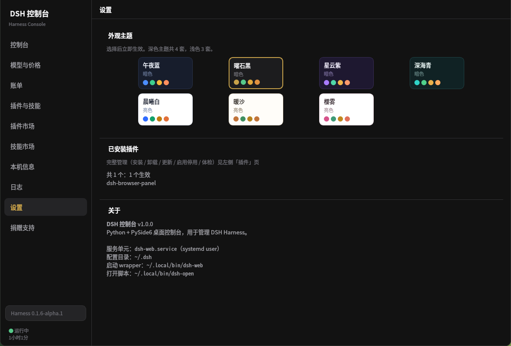
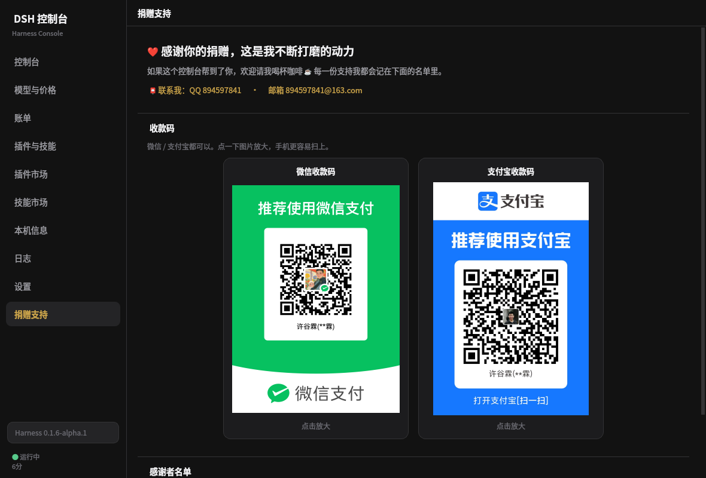

<div align="center">

# DSH 控制台 · DSH Console

**绿色免安装的 DeepSeek Harness 桌面控制台 —— 解压即用，一个窗口管完启停、账单、插件与技能。**

**A portable, zero-install PySide6 desktop console for DeepSeek Harness — unzip, run, manage everything in one window.**

**简体中文** · [English](#-english)


[](https://github.com/xugulin/dsh-console/actions/workflows/macos.yml)

</div>



## 📸 截图 · Screenshots

|  |  |
|---|---|
|  |  |
| **模型与价格 · Models & pricing**<br>峰谷档位与切换倒计时、随峰谷实时切换的价目表<br>*Peak / off-peak tiers, live-switching price table* | **插件与技能 · Plugins & skills**<br>安装 / 卸载 / 更新 / 启用停用、技能四个来源根<br>*Install, uninstall, update, enable/disable; four skill roots* |
|  |  |
| **设置 · Settings**<br>7 套亮 / 暗主题、插件摘要、关于<br>*7 light / dark themes, plugin summary, about* | **捐赠支持 · Donate**<br>微信 / 支付宝收款码并排 + 感谢者名单<br>*WeChat / Alipay QR codes side by side + thank-you list* |

> 截图摄于本机实跑，默认 1180×800 窗口；余额已打码。
> *Captured from a real run at the default 1180×800 window. The balance is redacted.*

---

## 🇨🇳 简体中文

### 平台与验证 · Platforms & verification

| 平台 | 状态 | 怎么验证的 |
|---|---|---|
| **Linux** | ✅ 完整支持（便携包） | 作者实机 + `./run.sh --self-test` |
| **Windows 10/11** | ✅ 完整支持（便携包） | 用户实机反馈 + 打包时校验启动脚本（CRLF/GBK/BOM/param 位置） |
| **macOS** | ✅ 可跑（从源码；暂未提供便携包） | GitHub Actions 免费 macOS runner：[`macos.yml`](.github/workflows/macos.yml) —— 装 PySide6 6.11.2、离屏真起 Qt、**7 套主题全部渲染**、市场源设置对话框布局回归（压到 560×420 时控件不被压扁）、截图作为 artifact 上传。实测 **7/7 通过** |

> 这个工作流**特意只选不需要 harness、不需要网络**的检查（CI 上没有 DSH 服务与 API key），
> 并**上传截图**：出问题时能直接看图，而不是只看一行报错。

### 这是什么

**DSH 控制台**是 [DeepSeek Harness](https://www.npmjs.com/package/@deepseek-ai/dsh)（本机 `dsh-web` 服务）的桌面控制中心。不用再来回切终端、敲 `systemctl`、开浏览器标签页、记一堆 npm 命令——一个原生窗口就能启停服务、盯住 token 花费、逛插件与技能市场、升级 harness。

**基于什么搭的**：项目建立在 **DeepSeek Harness**（`@deepseek-ai/dsh`）之上——控制台不重造
agent，只把它管起来；界面用 **Python + PySide6（Qt 6）** 写；页面里的**内置浏览器基于 Chromium**
（QtWebEngine），所以打开 harness 的 web 界面不需要目标机器上装任何浏览器。

发布形态是**便携压缩包**：免安装、不要管理员权限、不在你机器上留垃圾。

### 为什么值得一试

| | |
|---|---|
| 🟢 **绿色无污染** | 解压就能跑。启动器把 `HOME` 关进包里，会话、配置、缓存、日志全都落在文件夹内，**不往真实家目录写东西**。实测跑完一遍 `~/.dsh`、`~/.npm` 零改动。整个文件夹删掉，系统干干净净。 |
| 📦 **零安装** | 便携包里自带 Python 3.14、PySide6、Node.js 和 harness 本体，目标机器**不需要预装任何东西**。 |
| 🔄 **可以更新** | 控制台支持在线更新：只替换 `app/` 和 `tools/`，旧代码自动备份成 `app.bak-<时间>`，**绝不碰**你的数据（`home/`）和运行时。harness 本体在专门的页面升级——选 `latest` / `next` / `alpha` 通道，一键升级并重启。 |
| 🚀 **启动方便** | 双击启动器即可（`.sh` / `.bat`，另有静默 `.vbs`），还能一键装带图标的桌面快捷方式。四种前端从控制台直接拉起：**内置浏览器**、**系统浏览器**、**TUI**、**PySide6 GUI**。 |
| 🖥️ **PySide6 原生 GUI** | 是真窗口，不是终端套壳——**7 套亮/暗主题**，页面懒加载，冷启动约 95 ms。GUI 版把 harness 自己的 web UI 装进原生窗口，所以它永远不会落后于上游。 |
| 📊 **账单消耗一目了然** | 账户余额、今日花费（¥ / $）、模型调用次数、总 tokens、缓存命中率、峰谷拆分、24 小时消费柱状图，以及按花费排序的会话明细。 |
| 🧩 **插件与技能** | 管理已安装的插件和技能（安装 / 卸载 / 更新 / 启用停用 / 体检），并逛市场：npm 搜索 + 官方目录（**3000+ 插件**）、技能市场（**100+**）。 |
| 🖧 **管理 harness 很方便** | 服务状态徽章、PID / 运行时长 / 内存 / 异常重启次数 / 端口 / 登录自启；**内置与系统两份 harness** 各自一个启动按钮；版本与升级通道；安装详情（路径 / bin / node / npm / registry）；Profile 与插件 bundle 顺序。 |
| 🧭 **不止是仪表盘** | 本机信息（CPU / 内存 / 磁盘 / 网络）、`journalctl` 日志查看器、随峰谷实时切换的模型价目表，界面全中文。 |

### 功能一览

| 页面 | 内容 |
|---|---|
| **控制台** | 服务状态与启停重启、用**内置 Chromium 浏览器**打开界面 / 复制地址、启动前端、今日消费 + 余额 + 24 小时柱状图 |
| **Harness** | 版本与升级（`latest` / `next` / `alpha`）、安装详情、运行状态、Profile 与插件 bundle |
| **模型与价格** | 当前峰谷档位与切换倒计时、实时价目表、¥ / $ 切换、从官方 API 同步 |
| **账单** | 账户余额、会话花费汇总、按花费排序的会话明细 |
| **插件与技能** | 两张表：插件（安装 / 卸载 / 更新 / 批量检查）与技能（四个来源根、启用停用、查看正文、调用统计） |
| **插件 / 技能市场** | npm 搜索 + 官方目录、排名与筛选、滑到底自动加载、镜像 / 区域 / 加速设置 |
| **本机信息** | 系统、CPU、内存、磁盘、网络、DSH 占用 |
| **日志** | journalctl 查看器 |
| **设置** | 7 套主题、插件摘要、关于 |
| **捐赠支持** | 支持这个项目——微信 / 支付宝收款码与感谢者名单 |

### 快速开始

**方式一 · 便携包（推荐，什么都不用装）**

1. 到 [Releases](../../releases) 下载对应平台的 zip：Linux 约 308 MB，Windows 约 353 MB。
2. 解压到任意位置（放 U 盘里也行）。
3. Linux 跑 `./Start-DSH-Console.sh`；Windows 双击 **`Start-DSH-Console.exe`**
   （原生启动器，不闪黑框；报错看不到就改用 `Start-DSH-Console-Debug.exe`）。
4. 可选：`./Install-Desktop-Shortcut.sh` / `Create-Desktop-Shortcut.bat`，装进启动器。

**方式二 · 从源码跑**

```bash
git clone https://github.com/xugulin/dsh-console.git
cd dsh-console
pip install -r requirements.txt      # 只需要 PySide6-Essentials >= 6.11.2
./run.sh                             # Linux
python main.py                       # Windows / 其他平台
```

需要 **Python ≥ 3.14**（会话文件用标准库 `compression.zstd` 解压）。QtWebEngine（`PySide6-Addons`）是可选项，只有"把 web UI 装进原生窗口"的 GUI 版才需要。

### 常见问题

**会改我的系统吗？**
便携包不会：`HOME` / `DSH_HOME` / `USERPROFILE` 都指向包内，配置和缓存都落在包里。源码运行只写一个文件：`~/.config/dsh-console/config.json`（记你选的主题）。

**依赖 systemd 吗？**
不依赖。便携模式下 harness 是控制台的子进程——pid 落在 `run/web.pid`，日志落在 `run/web.log`，所以没有 systemd 的机器也能用（同时能单独识别系统里那份 harness）。

**停止服务会不会弄丢我的网页登录态？**
不会。停止走 `SIGTERM` 并等它自己退；丢登录态的是 `kill -9`，控制台从不这么干。

**支持哪些平台？**
Linux 和 Windows，各一个 zip（harness 的原生模块是平台专属的）。

### 开发日志

设计取舍、实测数据和 **100+ 条"踩过的坑"** 都在 [docs/DEVELOPMENT.md](docs/DEVELOPMENT.md)（约 1700 行）。
想动这套界面之前值得先扫一遍。

### 联系与支持

- GitHub：[@xugulin](https://github.com/xugulin)
- **QQ：894597841**
- 邮箱：894597841@163.com
- 如果这个项目帮你省了时间，欢迎请我喝杯咖啡 ☕ —— 应用里有**捐赠支持**页。

---

## 🇬🇧 English

> [⬆ 回到中文 / Back to Chinese](#-简体中文)

### What is it

**DSH Console** is a desktop control center for [DeepSeek Harness](https://www.npmjs.com/package/@deepseek-ai/dsh) — the local web service that ships as `dsh-web`. Instead of juggling a terminal, `systemctl`, a browser tab and a pile of npm commands, you get one native window: start / stop / restart the service, watch token spend, browse the plugin & skill markets, and upgrade the harness — all offline-friendly.

**What it's built on:** the project sits on top of **DeepSeek Harness** (`@deepseek-ai/dsh`) — it doesn't
reimplement the agent, it manages it; the UI is **Python + PySide6 (Qt 6)**; and the **built-in browser is
Chromium-based** (QtWebEngine), so opening the harness web UI needs no browser installed on the target machine.

Shipped as a **portable zip**: no installer, no admin rights, no leftovers on your machine.

### Why you'll like it

| | |
|---|---|
| 🟢 **Green & portable** | Unzip and run. `HOME` is redirected *inside* the package, so sessions, config, caches and logs all live in the folder — nothing is written to your real home directory. Verified: `~/.dsh` and `~/.npm` stay untouched. Delete the folder and it's gone without a trace. |
| 📦 **Nothing to install** | The portable build bundles Python 3.14, PySide6, Node.js and the harness itself. Target machine needs **zero** prerequisites. |
| 🔄 **Updatable** | The console can update itself online: it replaces only `app/` and `tools/`, backs the old code up to `app.bak-<timestamp>`, and **never touches** your data (`home/`) or the runtimes. The harness itself upgrades on the dedicated page — pick the `latest` / `next` / `alpha` channel and restart. |
| 🚀 **One-click start** | Double-click the launcher (`.sh` / `.bat`, plus a silent `.vbs`), optionally install a desktop shortcut with icon. Four frontends launch straight from the console: **built-in browser**, **system browser**, **TUI**, and the **PySide6 GUI**. |
| 🖥️ **Native Qt GUI** | A real PySide6 window, not a terminal wrapper — **7 light/dark themes**, lazy-loaded pages, ~95 ms cold start. The GUI frontend embeds the harness's own web UI in a native window, so it's never out of date with upstream. |
| 📊 **Billing at a glance** | Account balance, today's spend (¥ / $), model calls, total tokens, cache hit rate, peak / off-peak split, a 24-hour spend chart, and a per-session cost table. |
| 🧩 **Plugins & skills** | Manage installed plugins and skills (install / uninstall / update / enable / disable, with health checks) and browse the markets: npm search plus the official catalog (**3000+ plugins**), and a skills market (**100+**). |
| 🖧 **Harness, managed** | Service status badge, PID / uptime / memory / restart count / port / autostart; **two harness sources** (bundled vs. system) with explicit start buttons; version & upgrade channels; install details (path / bin / node / npm / registry); profile, bundle order, patch layer. |
| 🧭 **More than a dashboard** | Machine info (CPU / memory / disk / network), a `journalctl` log viewer, model price list that switches live with peak/off-peak, and a 简体中文 UI throughout. |

### Features

| Page | What it does |
|---|---|
| **Dashboard** | Service status & control (start / stop / restart / open UI in the Chromium-based built-in browser / copy address), frontend launchers, today's spend + balance + 24 h chart |
| **Harness** | Version & upgrade (`latest` / `next` / `alpha`), install details, run status, profile / plugin bundles |
| **Models & Pricing** | Current peak / off-peak tier with countdown, live price table, ¥ / $ toggle, sync from the official API |
| **Billing** | Account balance, session cost totals, per-session breakdown sorted by cost |
| **Plugins & Skills** | Two tables: plugins (install / uninstall / update / batch update check) and skills (four source roots, enable / disable, preview, call stats) |
| **Plugin / Skill Market** | npm search + official catalog, ranking & filters, infinite scroll, mirror / region / proxy settings |
| **Machine Info** | System, CPU, memory, disk, network, DSH footprint |
| **Logs** | journalctl viewer |
| **Settings** | 7 themes, plugin summary, about |
| **Donate** | Support the project — WeChat / Alipay QR codes and a thank-you list |

### Quick start

**Option A — portable (recommended, nothing to install)**

1. Download the zip for your platform from [Releases](../../releases): Linux ≈ 308 MB, Windows ≈ 353 MB.
2. Unzip anywhere (a USB stick works).
3. Run `./Start-DSH-Console.sh` on Linux, or double-click **`Start-DSH-Console.exe`** on Windows
   (native launcher, no console window; `Start-DSH-Console-Debug.exe` if you need to read an error).
4. Optional: `./Install-Desktop-Shortcut.sh` / `Create-Desktop-Shortcut.bat` to add it to your launcher.

**Option B — from source**

```bash
git clone https://github.com/xugulin/dsh-console.git
cd dsh-console
pip install -r requirements.txt      # only PySide6-Essentials >= 6.11.2 is required
./run.sh                             # Linux
python main.py                       # Windows / anywhere else
```

Requires **Python ≥ 3.14** (session files are decompressed with the stdlib `compression.zstd`). QtWebEngine (`PySide6-Addons`) is optional — only needed for the GUI frontend that embeds the web UI.

### FAQ

**Does it modify my system?**
The portable build: no. `HOME` / `DSH_HOME` / `USERPROFILE` point inside the package, so configs and caches land there. Running from source writes exactly one file: `~/.config/dsh-console/config.json` (your theme choice).

**Does it need systemd?**
No. In portable mode the harness is a child process of the console — the PID goes to `run/web.pid` and the log to `run/web.log`, so it works on machines without systemd (and detects a system-wide harness separately).

**Will stopping it break my browser logins?**
No. Stop uses `SIGTERM` and waits for a clean exit — a `kill -9` is what loses the browser plugin's cookies, and the console never does that.

**Windows and Linux?**
Both, as separate zips (native modules in the harness are platform-specific).

### Development log

Design trade-offs, measured benchmarks and **100+ "pitfalls we actually hit"** are written up in
[docs/DEVELOPMENT.md](docs/DEVELOPMENT.md) (Chinese, ~1700 lines). Worth skimming before you change the UI.

### Contact

- GitHub: [@xugulin](https://github.com/xugulin)
- **QQ: 894597841**
- Email: 894597841@163.com
- If this project saves you time, a coffee is welcome ☕ — see the **Donate** page in the app.

---

<div align="center">

`deepseek` · `deepseek-harness` · `dsh` · `console` · `pyside6` · `qt6` · `portable` · `green-software` · `no-install` · `zero-install` · `billing` · `token-usage` · `cost-tracking` · `plugin-manager` · `skills` · `npm` · `linux` · `windows` · `desktop-app` · `控制台` · `便携版` · `绿色软件` · `免安装` · `解压即用` · `账单统计` · `插件市场`

</div>
