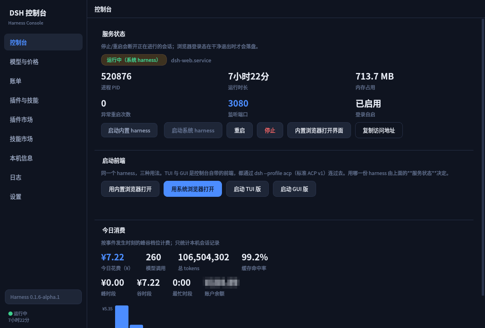

# DSH 控制台

一个 Python + PySide6 写的桌面控制台，用来管理本机的 **DSH Harness**（systemd user 服务 `dsh-web`）：
启停重启、实时状态、DeepSeek 模型与峰谷价格、账户余额与会话花费。**7 套亮/暗主题**可选。



## 功能

| 页面 | 内容 |
|---|---|
| **控制台** | 服务状态徽章、PID / 运行时长 / 内存 / 异常重启次数 / 端口 / 登录自启；重启·停止·**内置浏览器打开界面**·复制地址（**「启动」按钮已换成「启动内置 harness / 启动系统 harness」**，见下）；**启动前端**（用内置浏览器打开 / 用系统浏览器打开 / TUI 版 / GUI 版）；**今日消费**（¥/$、调用数、tokens、缓存命中率、峰/谷拆分、24 小时柱状图、**账户余额**） |
| **Harness** | 版本与升级（已安装 / latest / next / alpha、检查更新、选通道一键升级、重启使其生效）；安装详情（路径 / bin / Node / npm / registry / 升级权限 / 包名）；运行状态（单元 / PID / 时长 / 内存 / 端口 + **代码是否已生效**）；Profile（目录 / bundle 顺序 / 已装插件 / patch 层停用项）。入口是**侧边栏底部的版本按钮**，见「Harness 版本与升级」 |
| **模型与价格** | 当前峰谷档位与**下一次切换倒计时**；模型价目表随峰谷**实时切换**；¥ / $ 切换；自动从官方 API 同步模型列表 |
| **账单** | 账户余额（官方 API）；会话花费汇总；按花费排序的会话明细 |
| **插件与技能** | 分段按钮切换两张表：**插件**（安装/卸载/更新/启用停用/批量更新检查）与**技能**（四个来源根汇总、启用停用、查看正文、调用统计） |
| **插件市场** | npm 搜索 + 官方目录（3632 个）双数据源；排名/评分/星标；关键字与形态筛选；**滑到底自动加载更多**；**市场源设置**（区域/npm 镜像/GitHub 加速/自动发现测速） |
| **技能市场** | 同上，数据源为 DSH 技能类插件（125+，同样支持**滑到底加载**）；**市场源设置**为 GitHub 仓库源 |
| **本机信息** | 系统 / CPU / 内存 / 磁盘 / 网络 / DSH 相关占用 |
| **日志** | journalctl 查看器（原先塞在控制台页里的"最近日志"已移除） |
| **设置** | 主题色卡（7 套）、插件摘要、关于 |
| **捐赠支持** | 感谢语 + **微信 / 支付宝收款码并排**（点图片放大到手机扫得动的尺寸）+ **感谢者名单**（读 `donate/donors.json`）。入口在侧边栏「设置」下面 |

所有列表都用**固定行数表格**（插件页 8 行、市场页 10 行）：高度不随数据量变化，
超出部分内部滚动，页面布局不会因为插件变多而被撑长、按钮不会被顶出屏幕。

### 捐赠页的数据目录（`donate/`）

收款码和名单都是**数据文件**，不是代码——加一位捐赠者只要改 JSON，不用动源码、也不用重新打包：

```
donate/
├── wechat-qr.png    显示在「微信收款码」框里
├── alipay-qr.jpg    显示在「支付宝收款码」框里
└── donors.json      感谢者名单
```

名单格式（只有 `name` 必填，其余可省）：

```json
{"donors": [{"name": "张三", "amount": "¥50", "date": "2025-09-17", "message": "工具很好用，感谢！"}]}
```

* 也接受 `["张三", "李四"]` 这样的纯名字数组，以及 `名字 / 金额 / 日期 / 留言` 这组中文键名；
* 切到这一页会**重读一次名单**（在编辑器里改完、切走再切回来就是最新的，
  页面本身不放「刷新」按钮——那一页是给访客看的，不是维护面板）；
* 文件写坏了（少个括号之类）会**指出错在第几行**，而不是装作"还没有捐赠者"——
  这两种情况必须区分得开，否则名单不显示时根本不知道是自己写错了还是没人捐；
* 图片缺失时显示占位说明并写明期望路径，不到处找；
* 两张码在**固定尺寸**的框里等比居中（海报比例不同，按宽度缩放会一高一低），
  页面装不下时整体滚动，不会把码压扁；
* 目录可以用环境变量 `DSH_CONSOLE_DONATE_DIR` 换到别处（便携包里就靠这条兜底）。


## 响应速度（实测）

界面"卡死"曾经是这套控制台最严重的问题，根因有三个，都不是靠"优化一下"能解决的：

| 场景 | 修复前 | 修复后 |
|---|---|---|
| 启动（构造 8 个页面） | 触发 10 个网络/CPU 后台任务 | **95 ms，零后台任务** |
| 插件市场列表渲染 | **69,600 ms** | 25 ms |
| 体检/拉取期间的 GUI 停顿 | **11,219 ms** | 18 ms |
| 会话花费扫描 | 2,780 ms（解压两遍） | 1,760 ms（一遍） |
| 全流程最大停顿（8 个页面走一遍） | — | **60 ms** |

测量方法：在主线程上循环 `processEvents()` 并记录两次调用之间的间隔——
那个间隔就是 GUI 线程被占住、无法响应输入的时间。

三条根因（细节见下方"踩过的坑"第 10–12 条）：

1. **`QTableWidget` + `ResizeToContents` 是 O(n²)**：每次 `setItem` 都会把所有行
   重新量一遍。市场页 250 行 × 7 列要 11.2 秒。现在 `FixedTable` 是
   `QTableView` + 自定义模型，渲染虚拟化，填表只给 Python 列表赋值。
2. **29 MB 的 JSON 缓存写回会独占 GIL**（`json.dumps` 期间别的线程拿不到解释器锁）。
   现在原始文档解析完即丢，只留几十 KB 的紧凑清单。
3. **页面在 `__init__` 里就发请求**：启动瞬间 8 个页面各自发起网络/子进程任务。
   现在改成懒加载——`MainWindow._activate(i)` 只在页面**第一次真正显示**时调用
   `page.activate()`，切走时 `deactivate()` 停掉定时器。

### 滑到底自动加载更多

npm 搜索**不是只有 250 条**——那是我自己把 ``size`` 写成了 250。实际上带
``dsh-plugin`` 关键字的包有 **4927** 个，``size`` 单页上限 250，但可以用 ``from`` 翻页。

现在两个市场都是**分页加载**：首屏 80 条，滚到距底部十几行时自动取下一页并追加，
**表格高度恒定不变**（370px），只是内部滚动范围变长。实测：

```
插件市场：80 → 160 → 240 → 320 → 400 → 480 … （源共 4927）
技能市场：58 → 102 → 123 → 135 → 141 → 147 → 150 … （源共 4927，逐页过滤后递增）
表高：370px → 370px（不变）
```

技能市场增长较慢是因为它是"先按 skill 取候选、再本地过滤"，越往后技能类包越稀疏，
这是真实的分布，不是 bug。

### 市场源：为什么现在多了 14 倍

之前市场只有一条数据来源——npm 搜索，而它**一次最多返回 250 条**。加上官方目录后：

| 数据源 | 收录量 | 特点 |
|---|---|---|
| npm 搜索（`keywords:dsh-plugin`） | 250 条上限 | 有下载量/更新时间，可算评分 |
| **官方目录**（awesome-dsh-plugin） | **3632 个 / 23 分类** | **中文描述**、分类、星标、现成安装命令 |

「插件市场」页顶部可以切换数据源；目录模式会多出一个**分类**下拉，并把「评分」列
换成「星标」（目录的真实字段，而不是拿别的指标硬凑）。

目录文件 3.2 MB（gzip 约 890 KB，本机下载约 47 秒），所以**落盘缓存 6 小时**、
解析结果常驻内存——实测后台解析 3 MB 时 GUI 停顿只有 **16 ms**。

### 区域与 GitHub 加速

区域取值**刻意与已安装的 dshmarket 插件一致**，避免"控制台能装、插件装不动"：

| 区域 | npm registry | GitHub 加速 |
|---|---|---|
| 国际 | registry.npmjs.org | 不使用 |
| 中国大陆 | mirrors.cloud.tencent.com/npm | gh-proxy.com（备用 ghfast.top） |

加速前缀可自定义，也内置了几个常见公共代理。代理接收的是**完整目标 URL 作为路径**
（`{proxy}/{url}`），与 dshmarket 的 `throughProxy()` 同一约定。

⚠️ 环境变量 `DSHM_NPM_MIRROR` / `DSHM_GITHUB_PROXY` / `DSHM_REGISTRY_URL`
**优先级高于本页配置**；检测到时会显示"由环境变量托管"并说明改这里不会生效——
否则用户改了却不生效只会更困惑。

### 已安装技能

技能散落在四个根目录（与技能中枢的 provider 一致）：

| 来源 | 路径 | 可写 |
|---|---|---|
| user-dsh | `~/.dsh/skills` | ✅ |
| user-agents | `~/.agents/skills` | ✅ |
| project-dsh | `<项目>/.dsh/skills` | ❌ 只读 |
| project-agents | `<项目>/.agents/skills` | ❌ 只读 |

技能是含 `SKILL.md` 的目录，或扁平的 `<name>.md`；frontmatter 声明
`name` / `description` / `sets`。**停用 = 把发现文件重命名加 `.disabled`**（不删除内容，
随时可恢复），并把变更同步进技能中枢 sidecar 的 `disabled` 数组，两边状态一致。

### 源自动发现与评分

插件市场的「市场源设置」对话框可以**一键并发探测**全部候选源，用实测数据排序：

| 维度 | 权重 | 怎么量 |
|---|---|---|
| 可达性 | 30 | 能不能连上（连不上其它都无意义） |
| 延迟 | 25 | 小请求的 TTFB，按 300ms 线性折算 |
| 资源数量 | 30 | 该源能提供多少东西（目录条目数 / npm 搜索 total） |
| 官方来源 | 15 | 官方站点/registry 加分 |

评分公式是**可解释的加权分**（权重写在 `probe.WEIGHTS`），不是黑箱排名。

实测 11 个候选源 11 秒探完，结果里有个值得注意的发现：**gh-proxy.com 返回 HTTP 403**
（它的策略只放行特定 GitHub 服务），而 dshmarket 的源码注释恰好警告过这个代理
"策略是运营方的、随时会变，要实测不要推断"——探测正好把它抓了出来。

另一个重要提示：探测会区分「**能装包**」和「**搜索接口可用**」。腾讯云/阿里/华为
几个镜像延迟低、吞吐高，但**不提供 npm 搜索 API**——切过去会发现市场列表拉不出来。
所以每个源的说明列会明确写出这一点，而不是让人切完才发现。

### 今日消费

只统计本机会话记录，按**事件发生时刻**的峰谷档位计费。为了不拖慢界面，只扫
``mtime`` 落在今天的会话文件（会话文件是追加写的，今天有事件的文件 mtime 必然在今天），
实测 7 个文件、约 115 ms。

会给出缓存命中率、峰/谷花费拆分、24 小时分布（橙色柱=峰时段），以及按模型/按会话的明细。

### 插件市场的两处筛选

- **关键字筛选**：在已拉取的结果上按「包名 / 说明 / 标签」本地匹配，输入即筛。
- **形态筛选**：`全部 / 有前端半 / 有宿主半 / 仅前端半 / 仅宿主半 / 两者都有`。
  判断依据是包的 `dsh` 清单（`dsh.bundle.patch` = 有宿主半，`dsh.client` = 有前端半），
  而这**只有拉取注册表详情才知道**——search 接口不返回该字段，npm 上也没有
  `dsh-client`/`dsh-host` 这类关键字约定（实测 250 个包里 0 个使用，连
  `@morlay/session-branch` 这种纯宿主插件也没打相关标签）。

  所以形态筛选依赖先点「**补齐体检**」：它并发拉取详情（实测 16 并发约 0.3–0.9 秒/个，
  250 个约 1–3 分钟，结果缓存 6 小时），按钮上会显示覆盖率 `(247/250)`；
  未体检的条目在选择形态筛选时会被排除，并在状态栏明确告诉你有几个被排除。

- **排名列不会被筛选重排**：筛出 54 条时显示的仍是它们在完整榜单里的位次
  （11、12、13、16…），而不是 1、2、3，否则看不出真实位置。

## 快速开始

```sh
git clone https://github.com/xugulin/dsh-console.git
cd dsh-console
./run.sh
```

解释器不用管，`run.sh` 自己会挑（见下）。

```sh
./run.sh --list-themes     # 列出所有主题
./run.sh --theme daylight  # 指定主题启动
./run.sh --self-test       # 无界面自检：价格 / 服务 / 插件 / 会话花费 / 余额
```

## 环境要求与安装

- **Python ≥ 3.14** —— 读会话文件用的是标准库 `compression.zstd`（3.14 起才有），因此不能降级。
- 系统 Python 受 PEP 668 保护（`EXTERNALLY-MANAGED`），PySide6 **装不进系统 Python**，必须用 venv。

推荐做法是在项目根建一个 **3.14** 的 venv 并装上依赖（`README.md` 的「方式二」）：

```sh
python3.14 -m venv .venv
./.venv/bin/python -m pip install -r requirements.txt
```

想用别的环境就设 `DSH_CONSOLE_VENV` 指过去。**源码里不写死任何绝对路径**——
写死了别人 clone 下来只会看到一条自己机器上不存在的路径。

`run.sh`、`tools/install-desktop.sh` 和 `main.py` 共用同一套解释器解析逻辑
（`tools/find-python.sh`），按下面的顺序找，**每个候选都要同时满足版本 ≥ 3.14 且能
`import PySide6`**：

| 顺序 | 候选 | 说明 |
|---|---|---|
| 1 | `$DSH_CONSOLE_PYTHON` | 显式覆盖；设了就**只认它**，不合格直接报错而不是偷偷换一个 |
| 2 | `$DSH_CONSOLE_VENV/bin/python` | 可选的标准运行时；**没设就跳过这一档** |
| 3 | `<项目>/.venv/bin/python` | 项目自带 venv（推荐，别处 clone 下来建这个就行） |
| 4 | `python3.14` / `python3` | 系统解释器；版本够但通常缺 PySide6 |

> 顺序是"显式覆盖 → 项目自带 `.venv` → 系统解释器"。`.venv` 排在系统解释器前面是
> 因为系统 Python 装不进 PySide6（PEP 668）；要换环境就设 `DSH_CONSOLE_PYTHON`。

都没有时 `run.sh` 会列出每个候选被拒的原因，并打印补齐依赖的命令。用别的解释器：

```sh
DSH_CONSOLE_PYTHON=/path/to/python ./run.sh
```

> 三个入口（`run.sh` / `python main.py` / 桌面启动器）行为一致：直接 `python main.py`
> 而解释器不对时，`main.py` 会自己 `exec` 换成上面那个合格解释器，而不是甩一句
> `ModuleNotFoundError`。想避免这种自动切换就设 `$DSH_CONSOLE_PYTHON`。

补齐依赖（正常不用做，环境已经建好了）：

```sh
./.venv/bin/python -m pip install -r requirements.txt
```

> 只装 `PySide6-Essentials`（QtCore/QtGui/QtWidgets）而不是完整 `PySide6`：
> 76 MB vs ~500 MB，本机网络慢时差别很大。功能上完全够用。

## 桌面快捷方式

```sh
./tools/install-desktop.sh
```

装完在应用启动器里搜「DSH 控制台」（Super 键唤出）。想一键直达就右键固定到面板/Dock。

> **关于"桌面图标"**：本机桌面是 **COSMIC**，它没有桌面图标层（不运行 `cosmic-desktop`），
> 所以把 `.desktop` 放在桌面背景上不会显示图标；而且 `XDG_DESKTOP_DIR` 指向 `$HOME` 本身。
> 因此这里装到 `~/.local/share/applications/`，走应用启动器——这是 COSMIC 下等效且真正有效的做法。

## Harness 版本与升级

harness 有**自己的一页**——那个 npm 全局包 `@deepseek-ai/dsh`，`dsh` 命令就是它的 bin，
控制台 / web / TUI / GUI 全跑在它上面。

入口是**侧边栏底部的版本按钮**（平时就显示当前版本，如 `Harness 0.1.5-rc.1`），
点它切到 Harness 页。之所以从「控制台」页挪出来：控制台页回答的是"服务活着吗、怎么用"，
这一页回答的是"跑的是哪个版本、装在哪、要不要升级、升级完要不要重启"——信息量差一个
数量级，一张卡片塞不下。

页面分四块：

| 卡片 | 内容 |
|---|---|
| **版本与升级** | 已安装版本 + `latest`/`next`/`alpha` 三条通道（比已安装新会标 `↑`）；「检查更新」/ 通道下拉 /「更新 harness」/「重启使其生效」 |
| **安装详情** | 安装路径、可执行文件、Node、npm、npm registry、升级权限、包名 |
| **运行状态** | 单元状态 / PID / 运行时长 / 内存 / 端口，外加**「代码是否已生效」** |
| **Profile** | profile 目录、bundle 顺序、已安装插件数、patch 层托管停用项 |

### 「代码是否已生效」是怎么判断的

升级只替换磁盘上的文件，**已经在跑的进程还是旧代码**，直到重启才换。用户升完级看不到
版本变化，很容易以为升级失败了。所以这里拿安装目录里 `package.json` 的 mtime 和进程的
启动时刻比一比：

* 文件更新 → 红字提示「磁盘上的代码比正在运行的进程新……点「重启使其生效」」；
* 否则 → 「运行中的就是当前安装的版本（安装于 …，进程启动于 …）」。

非 systemd 托管的实例也有这个判断：用 `/proc` 推出的已运行秒数反算启动时刻。

### 为什么要把三条通道都列出来

本机实测很有代表性：`latest` 是 `0.1.5-rc.1`，**正好等于已安装版本**，只看 latest 会得出
"已是最新"；但 `next` 已经到 `0.1.5-rc.2`、`alpha` 到了 `0.1.6-alpha.1`。
只盯 latest 会让人以为没得升，而用户可能正想上 next。所以这里把 `dist-tags` 整个取回来。

### 升级做的事，以及刻意不做的事

执行的命令就是（界面上会原样显示给你确认）：

```
sudo -n npm install -g @deepseek-ai/dsh@<通道> --no-audit --no-fund
```

* **`sudo -n`**：本机 `/usr/lib/node_modules` 是 root 的。`-n` 表示**拿不到免密就立刻失败**，
  绝不让控制台挂在一个看不见的密码提示上；没有免密 sudo 时卡片会直接告诉你
  "请在终端里手动升级"。
* **不传 `--allow-scripts`**：npm 12 默认拦下安装脚本并会提示你放开。查过了，这里**不需要**——
  `koffi` 靠 `@koromix/koffi-linux-x64` 这类平台二进制包、`node-pty` 靠自带的 `prebuilds/`，
  都不用编译；唯一正经做事的第一方脚本 `ensure-spawn-helper.mjs` 只是给 node-pty 的
  `spawn-helper` 补执行位，而那个文件在本平台的预编译产物里压根不存在，脚本本身空转。
  **本机现装这份 harness 从来没跑过安装脚本，照样工作正常**。既然没收益，就不该让一堆
  第三方 postinstall 以 root 身份跑一遍——那正是 npm 12 默认拦下它们要防的事。
  升级结果里会把 npm 的这条 warning 翻成人话附上，免得看到一屏 "warning" 以为装坏了。
* **绝不替你重启**：升级只换磁盘上的代码，正在跑的进程还是旧的。要不要重启由你决定——
  重启会中断正在进行的会话，所以控制台只提示「需要重启 harness 才会生效」，不自动动手。

### 实测

* 查询：`npm view` 走网络约 2 秒，之后命中 10 分钟缓存（页面每 3 秒刷新，不缓存会把 npm 打爆）。
* 升级：把同样的命令换个 `--prefix` 装到临时目录，**完整跑通**——退出码 0、30 秒
  （缓存热时）、装出 `0.1.5-rc.2`、`bin/dsh` 软链正确、`dsh --version` 输出新版本、
  安装脚本按预期被拦下。系统里那份没有动过。
* 冷缓存首次解析依赖树会慢得多（实测约 200 秒），所以超时给到 15 分钟，界面上会一直显示
  "正在升级…（下载中，可能要几分钟）"。

## 三种前端

同一个 harness，三种用法。「控制台」页的**启动前端**卡片上各有一个按钮：

| 按钮 | 是什么 | 怎么连上 harness |
|---|---|---|
| **启动 web 版** | harness 自带的浏览器界面 | 保证 `dsh-web` systemd 单元在跑，再打开带 token 的地址 |
| **启动 TUI 版** | 本项目自带的**终端**对话界面 | 新起终端 → `python -m dsh_console.tui` → `dsh --profile acp` |
| **启动 GUI 版** | 原生窗口里跑 **harness 自己的 web UI** | 保证 `dsh-web` 在跑，用 QtWebEngine 装进窗口 |

也可以直接敲命令，不经过按钮：

```sh
./run.sh --tui                     # 终端版（需要已经在一个终端里）
./run.sh --gui                     # GUI 版（默认：web 同款界面）
./run.sh --tui --cwd ~/some/repo   # 指定 agent 的工作目录
./run.sh --gui --native            # GUI 版改用原生 ACP 客户端（不依赖 web 服务）
```

### GUI 版为什么是"装进去"而不是"照着做一遍"

要求是「GUI 版与 web 版界面及功能完全一致」。harness 的 web UI 不是一张页面，而是由
几十个 `dsh-client-ui-*` 插件组成的 React 应用（会话与轨迹、子代理、计划、目标、作业、
命令、工作区文件、设置、主题…）。用 Qt 控件复刻，最好也只是"像"，不可能**一致**，
而且 harness 每升一次级复刻版就落后一截。

所以 GUI 版把那个 UI **本身**装进原生窗口：`QtWebEngineView` + 一层原生外壳。
界面与功能的一致性是**构造上**保证的——因为它就是 web 版。

外壳负责原生该负责的事：

* **起服务**：`dsh-web` 没在跑就先拉起来，等带 token 的地址就绪再加载，
  不用先开浏览器再复制地址；
* **持久 profile**：cookie 落在 `~/.cache/dsh-console/webengine`。token 每次服务重启
  都会换，只靠 URL 里的 token 是不够的，所以 cookie 必须落盘；
* **地址失效自愈**：加载失败或 401 时自动重新取一次地址（服务重启后 token 会变）；
* **原生菜单**：新会话 / 重新加载 / 重新获取地址 / 复制地址 / 在系统浏览器打开 /
  开发者工具 / 缩放 / 全屏，快捷键 `Ctrl+R`、`Ctrl+Shift+R`、`F11`、`F12` 等；
* **状态栏**：加载状态 + 地址（**只显示 `scheme://host:port`，不带 token**）；
* **关窗只是关窗**：绝不停掉 harness——那是控制台「停止」按钮的职责。

> 想用不依赖 web 服务的**原生**聊天窗口（不引 QtWebEngine、直接对 `dsh --profile acp`
> 说话），用 `./run.sh --gui --native`。那条路是另一套实现，**不是**"与 web 版一致"的那一个。

### 为什么用 ACP，而不是去猜 web 的协议

harness 自带的前端只有 web。要自己写 TUI/GUI，有两条路：逆向前端用的私有传输，或者用
harness 明确为外部客户端准备的那条路——**`dsh --profile acp`**。选后者：

* 它实现的是**标准 ACP v1**（Zed 的 agent-client-protocol），不是私有协议，
  所以客户端逻辑不依赖 harness 的内部实现；
* 传输是**换行分隔的 JSON-RPC 2.0**（一行一条消息），stdlib 的 `json` + 管道就能说清楚；
* **stdout 只走协议流量**，日志走 stderr，解析不会被日志污染；
* 会话是持久化的，所以 `session/list` / `session/resume` 能接着上次的聊。

协议细节与实测过的消息形状都记在 `dsh_console/acp_client.py` 的模块 docstring 里，
TUI 和 GUI 共用这一个客户端。

### TUI 版怎么"在终端里打开"

"从程序里开一个终端跑指定命令"在 Linux 上没有统一做法，所以 `dsh_console/frontends.py`
按两条路走：

1. **终端有 exec 开关**（`xterm -e`、`konsole -e`、`gnome-terminal --`、`xdg-terminal-exec`…）
   ——内置了一张表，按顺序找第一个装了可用的，argv 直接透传，不经过 shell。
2. **终端只认 `$SHELL`**——本机只装了 **cosmic-term，而它没有任何 exec 开关**
   （`--help` 里只有 `--version` 和 `--working-directory`）。所有终端都会用 `$SHELL`
   启动会话，于是把 `$SHELL` 指向 `tools/tui-shell.sh`，由它 `exec` 我们的 TUI。
   这条路径是在 Xvfb 上实测过的，不是猜的。

两条都不通时**不装死**：卡片上会直接给出可以粘贴运行的完整命令。

想指定终端就设环境变量（支持 `{cmd}` 占位符）：

```sh
DSH_CONSOLE_TERMINAL="xterm -e" ./run.sh          # 用 xterm
DSH_CONSOLE_TERMINAL="gnome-terminal -- {cmd}" ./run.sh
```

### 两个前端长什么样

**TUI 版**（curses，只用标准库）：版面照 web 版的分栏来——**左侧主栏**（表头 / 对话区 /
输入行 / 状态栏）+ **右侧整高的说明面板**。web 版是「左栏工作区 · 中间对话 · 右侧栏」，
终端里没有可点的工作区列表，于是把右侧栏做成常驻的操作说明。用户消息也照 web 的样子
**靠右**排。

```
┌────────────────────────────────────────────┬──────────────────┐
│ DSH 对话 · 项目名     模型 · 会话 · 用量    │ 发送与退出        │
│                        只回答两个字：收到   │ Enter  发送输入…  │
│ 收到                                       │ Ctrl+C 跑着→取消… │
│ . 本轮结束：end_turn（1.0s）               │ …（一直显示）     │
├────────────────────────────────────────────┤                  │
│ > 在这里打字                                │                  │
├────────────────────────────────────────────┤                  │
│ [就绪]                  Tab 切焦点 · F1 …  │ ↓ 还有 N 行       │
└────────────────────────────────────────────┴──────────────────┘
```

**右侧说明面板常驻**，分「发送与退出 / 输入行编辑 / 滚动与焦点 / 鼠标 / 显示·其它」
五节，列出全部按键与鼠标操作。它**从顶部开始读**（不像对话区那样在底部追最新），内容
装不下时最后一行变成滚动指示 `↓ 下面还有 N 行`。面板里每一条都真的能用——改了按键
绑定就得同步改 `HELP_SECTIONS`，否则面板会开始骗人。

鼠标是真接了的：**滚轮按指针所在的区决定滚谁**、**点输入行把光标挪到点中的位置**、
点某个区把焦点切过去。代价是终端自身的拖选会被应用接管，多数终端**按住 Shift 拖动**
仍可选中文本（面板里写了这一条）。

按键：`Enter` 发送 · `Ctrl+C` 取消本轮（空闲时退出）· `Ctrl+D` 退出 · `Tab` 切换焦点
（决定 `↑↓/PgUp/PgDn` 滚哪个区）· `F1` 显示/隐藏面板 · `Ctrl+T` 显示/隐藏思考 ·
`Ctrl+L` 重绘 · 输入行支持 `←→/Home/End/Ctrl+A/E/W/K/U/Backspace/Delete`。
（`Ctrl+H` 在终端里与退格同码，所以面板开关用的是 `F1`。）

面板宽度自适应：终端 ≥ 78 列给 42 列；更窄先压缩面板，压到不足 24 列干脆藏起来。
表头右侧的「模型 · 会话 · 上下文用量」在主栏变窄时**优雅降级**：先丢会话号、再丢模型名，
用量留到最后——它每轮都在变，最该看见。

#### 会话 / 模型 / 工作区

四个操作，都走**覆盖式选择器**（列表 + 输入即筛选 + `↑↓` 选 + `Enter` 确认 + `Esc` 取消，
鼠标也能点）：

| 键 | 操作 | 选择器里能看到什么 |
|---|---|---|
| `F2` | **命令面板** | 下面这些全都在里面，不用记 F 键 |
| `Ctrl+N` / `F6` | 新建会话 | 立刻在当前工作区建一个并清空对话区 |
| `F3` | 切换会话 | 可恢复的会话，带**标题、工作目录、相对时间**，当前那个有「当前」标记 |
| `F4` | 切换模型 | 模型 + 推理档位（`configOptions` 里的全部 select），当前项预选 |
| `F5` | 切换工作区 | 用过的目录（带会话数）；也可以**直接敲路径**，第一行会变成「用这个路径新建会话」 |

打开选择器时会**预选当前项**——不预选的话按一下 `↓` 很可能正好停在当前项上，看起来像
"按了没反应"（这个坑实测踩过）。新建会话会把当前的模型/推理档位**带过去**：ACP 的
`session/new` 没有模型参数（查过 schema，只收 `cwd`/`additionalDirectories`/`mcpServers`），
所以是建完再用 `set_config_option` 补设的。

切换会话有个必须处理的坑：ACP 的 `session/resume` **不回放旧更新**，恢复完界面是空的。
所以切过去时会顺带从会话日志（`~/.dsh/sessions/...`）把最近的对话**重建成暗色历史条目**
（用户/助手/工具各带前缀），不然"切换会话"等于什么也没切。日志很大（实测一份 3787 条事件、
解压 3 MB 出头，重建约 0.5 秒），所以只在切换时读一次、放在后台线程里。标题和时间则来自
DSH 自己的投影缓存 `~/.dsh/storages/session_projcache/`（未压缩小 JSON，全部读一遍 8 ms）。

中文按**显示宽度**折行、续行做悬挂缩进：`len()` 在中文上不等于列数，这一条不做就会
串行和溢出（`tools`/自检里都有针对它的断言）。

**GUI 版**：里面就是 web UI 本身，所以"长什么样"不需要在这里描述——和浏览器里打开
一模一样，包括侧边栏工作区、会话列表、对话/轨迹/浏览器三个页签、思考折叠、工具卡片、
用量与缓存命中率这些。原生外壳额外给的是菜单、状态栏、缩放与全屏。

**`--native` 模式**（不用 web 服务的那条路，PySide6 原生控件）：顶栏是模型下拉（认
`configOptions` 里的分组）、思考开关、推理档位、上下文用量条、重连；中间是对话区
（正文 / 灰色斜体的思考 / 工具行，点工具行在下方看它的入参与输出）；底部是多行输入
（`Enter` 或 `Ctrl+Enter` 发送、`Shift+Enter` 换行）与停止按钮；状态栏显示 session 短码、
工作目录、本轮耗时。

流式渲染有一处必须做的优化：`QTextBrowser` 每次 `insertText` 会重排整个被改段落，
5 万字的段落插一次要 10 ms，2000 个 chunk 直插就是 20 秒。现在 chunk 先进缓冲、
最多每 30 ms 合并插一次（插入越贵窗口越长），实测 **10–12 ms/chunk → 0.10 ms/chunk**，
且不丢字。（这条只对 `--native` 有效；GUI 版的流式是 web UI 自己实现的。）

### 前端进程的日志

TUI/GUI 拉起的 `dsh --profile acp` 子进程，以及 GUI 本身的 stdout/stderr，都写到
`~/.cache/dsh-console/gui.log`；连不上 harness 时先看这个文件。GUI 版**起不来**时
（没有显示器、Qt 平台插件加载失败…）提示行会直接把退出码和日志尾部写出来，
不会只留一句"已启动"。

## 数据来源

| 数据 | 来源 | 说明 |
|---|---|---|
| 服务状态 | `systemctl --user show dsh-web` **+** `ss -ltnp` **+** `/proc/<pid>` | 单元状态回答不了"harness 到底在不在跑"，见下方"服务状态怎么判定" |
| 访问地址 | `journalctl --user -u dsh-web` | 服务带 `--no-open` 启动，URL（含 token）打在 stdout |
| 会话花费 | `~/.dsh/sessions/*/*/session.v3.jsonl.zstd` | 标准库 `compression.zstd` 解压后逐事件计费 |
| 模型与价格 | 内置表（移植自 `dsh-tidewatch` 的 `pricing.js`）+ 官方 API `/models` | 与 DSH 界面里那张峰谷卡片口径一致 |
| 账户余额 | `api.deepseek.com/user/balance` | API key 取自 `~/.dsh/.credentials.yaml` 的 `refs.DEEPSEEK_API_KEY` |
| 插件市场 | `registry.npmjs.org/-/v1/search?text=keywords:dsh-plugin` | 官方 npm registry；带 15 分钟磁盘缓存（网络慢） |
| 插件体检 | `registry.npmjs.org/<name>` | 版本历史、依赖、**安装期脚本**、README |

### 服务状态怎么判定（为什么不能只看 systemd）

`systemctl --user show dsh-web` 只回答"**这个单元**在不在跑"，回答不了
"**harness** 在不在跑"——这两件事经常不一样。在终端里敲一句 `dsh web` 就能让服务
活得好好的，而单元那边从头到尾都是 `inactive`；只看单元状态，控制台就会在界面明明
能用的时候报"已停止"。

所以状态是两路合起来的：

| 判据 | 来源 | 用途 |
|---|---|---|
| 单元在跑？ | `systemctl --user show` 的 `ActiveState` | 决定启停重启是否可用（只有它管得着才可用） |
| 有人在服务？ | `ss -ltnp` 找出占着端口的进程 | 决定"运行中 / 已停止"这个**结论** |
| 内存与运行时长 | 单元在跑读 `MemoryCurrent`；否则读 `/proc/<pid>/status`、`/proc/<pid>/stat` | 非托管实例落在 `session-N.scope` 里，systemd 对它的内存一无所知 |

于是有三种状态，徽章颜色也不同：

- **运行中**（绿）——单元 active，启停重启都可用，能从 journal 取到带 token 的地址。
- **运行中（非 systemd）**（黄）——端口被占但没有单元在管。这是**手工启动**的情形。
  此时 `systemctl start` 会 EADDRINUSE、`systemctl stop` 是空转，所以三个按钮一律
  禁用并在卡片里写明原因；带 token 的地址只打印在那个实例自己的终端里，控制台取不到，
  「打开界面 / 复制访问地址」同样不可用。
- **已停止 / 启动失败**——端口没人在听，显示单元上一次跑了多久、停了多久。

> 控制台**不会**去 kill 非托管实例：那种实例同样持有浏览器登录态，只有它在自己的终端里
> 收到 SIGTERM 才会干净落盘。想接管就先在启动它的终端里结束它，再点「启动」。

### 插件启用/停用为什么不用重启

profile 的 `package.json` 里是 `"patchReload": "live"`，宿主会 watch `cordis.patch.yml`
并实时重组插件树。所以停用一个插件只需要往 patch 层写一条：

```yaml
- id: tidewatch       # 注意是「装配行 id」，不是包名
  disabled: true
```

控制台写这些条目时会**包在一对哨兵注释之间**，与你自己手写的 patch 条目完全隔离：

```yaml
# >>> dsh-console managed: disabled plugins (auto-generated, do not edit by hand)
- id: tidewatch
  disabled: true
# <<< dsh-console managed
```

⚠️ 这个文件写坏会让正在运行的 harness 在热重载时出错，所以每次写入都走
**备份 → 写入 → `dsh --profile web --dump-config` 验证 → 失败自动回滚**。
实测启用/停用循环后文件可**逐字节还原**（`diff` 验证过）。

### 插件市场评分口径

市场页的「评分」是**控制台自算**的 0–5 分，依据全部可观测：

| 分项 | 满分 | 依据 |
|---|---|---|
| 使用量 | 2.2 | 周下载量，`log10` 刻度 |
| 活跃度 | 1.4 | 最近发布时间（30 天内满分） |
| 生态 | 0.7 | 被依赖数 |
| 规范 | 0.7 | 是否声明许可证与源码仓库 |

**没有**用 npm 的 `score.detail`——实测拉 250 个包，它恒为 `(1.0, 1.0, 1.0)`，
换算成星级就是"人人 5.0 星"，毫无区分度（详见下方"踩过的坑"第 6 条）。

**计费口径**：按每次调用**发生时刻**的档位计费，跨峰谷不漂移。

```
cost = ( input×缓存未命中 + output×输出 + (缓存读+缓存写)×缓存命中 + reasoning×reasoning价 ) / 1e6
```

峰时段为 UTC `01:00–04:00`、`06:00–10:00`（即北京时间 `09:00–12:00`、`14:00–18:00`），
UTC 周六/周日全天按谷期计价，**谷时价 = 峰时价的一半**。

## 目录结构

```
DSH控制台/
├── main.py                     入口（--self-test / --theme / --list-themes / --tui / --gui）
├── run.sh                      启动（解释器由 tools/find-python.sh 解析）
├── requirements.txt
├── tools/dsh-console.desktop.in  启动器条目模板（@HERE@ 占位符；由 install-desktop.sh 生成实际文件）
├── assets/icon*.png            图标（由 tools/make_icon.py 生成）
├── shots/                      离屏渲染的界面截图
├── tools/
│   ├── find-python.sh          解释器解析（run.sh / install-desktop.sh 共用）
│   ├── tui-shell.sh            「伪 shell」：给没有 exec 开关的终端转交 TUI
│   ├── screenshot.py           离屏渲染各页面为 PNG（无显示器也能自查）
│   ├── make_icon.py            生成图标
│   ├── build_bundle.py         **打可移植包**（Linux 专用 / Windows 专用 / 二合一）
│   ├── namecheck.py            静态查"用了但没定义"的名字（已接进自检）
│   ├── launchers.py            生成启动器 / 图标清单 / 包内说明文档（含 Windows 脚本硬校验）
│   ├── bat_sim.py              **模拟 cmd.exe 跑启动器 .bat**（本机没有 Windows 也能验逻辑）
│   └── install-desktop.sh      安装桌面快捷方式
└── dsh_console/
    ├── __init__.py             __version__
    ├── acp_client.py           ACP v1 客户端（TUI 与 GUI 的 --native 共用）
    ├── portable.py             **便携模式**：包内路径、运行时探测、清单
    ├── updater.py              **控制台自更新**（从发布地址换 app/，不动数据）
    ├── config.py               控制台配置读写（唯一真源）
    ├── harness.py              harness 自身的版本查询与升级（npm 全局包）
    ├── frontends.py            三种前端的启动逻辑（web / TUI / GUI，含终端探测）
    ├── tui.py                  TUI 版前端（curses，只用标准库）
    ├── browser.py              内置浏览器（QtWebEngine：多标签 / 地址栏 / 独立 profile）
    ├── browser_theme.py        内置浏览器的 30 套配色与深/浅/跟随系统
    ├── sessions.py             会话元数据与历史重建（切会话用）
    ├── gui.py                  GUI 版：QtWebEngine 装 harness 的 web UI + 原生外壳
    ├── gui_native.py           GUI 版的 --native 模式：PySide6 原生 ACP 聊天客户端
    ├── service.py              systemd 交互（启停重启 / 状态 / 日志 / 地址）
    ├── pricing.py              模型与峰谷价格（纯函数）
    ├── billing.py              余额 API + 会话成本聚合
    ├── market.py               插件市场（npm registry 客户端 + 磁盘缓存 + 自算评分）
    ├── catalog.py              官方插件目录（awesome-dsh-plugin，3.2 MB 目录的下载与解析）
    ├── sources.py              市场源配置（区域 / npm 镜像 / GitHub 加速 / 自动发现测速）
    ├── probe.py                插件体检（版本历史 / 依赖 / 安装期脚本 / README）
    ├── skills.py               技能发现（四个来源根 + 启用停用）
    ├── sysinfo.py              /proc 读取（CPU / 内存 / 磁盘 / 网络）
    ├── plugin_manager.py       插件生命周期（安装/卸载/更新 + patch 层启用停用 + 回滚保护）
    ├── themes.py               7 套主题的调色板与 QSS
    ├── workers.py              线程池封装（见下方"踩过的坑"）
    └── ui/                     界面层
        ├── main_window.py      侧边栏导航 + 页面堆栈 + 主题管理
        ├── components.py       Card / Metric / Pill / **FixedTable**
        ├── dialogs.py          插件详情 / 市场详情（含体检）/ 安装对话框
        ├── dialogs_sources.py  市场源设置对话框
        ├── page_dashboard.py   控制台（服务启停 + 启动前端 + 今日消费）
        ├── page_harness.py     Harness（版本 / 安装详情 / 运行状态 / Profile / 升级）
        ├── page_models.py      模型与价格
        ├── page_billing.py     账单
        ├── page_plugins.py     插件管理
        ├── page_plugins_skills.py  插件 / 技能分段切换
        ├── page_market.py      插件市场
        ├── page_skills.py      技能市场
        ├── page_skills_installed.py  已安装技能
        ├── page_sysinfo.py     本机信息
        ├── page_logs.py        日志
        ├── page_settings.py    设置
        └── page_donate.py      捐赠支持（微信/支付宝收款码 + 感谢者名单）
```

## 安全与注意事项

- **API key 只以掩码显示**（如 `sk-6aa…db37`），界面与日志都不会输出完整 key。
- **绝不要对 `dsh-web` 用 `kill -9`**：浏览器插件的 cookies/storage 只在干净退出时落盘，
  丢失 flush 会把所有网站登录态清掉。控制台的"停止/重启"走的都是 `systemctl`（SIGTERM）。
  便携包里同一条规矩：`_portable_stop()` 用 SIGTERM 并等它自己退。
- 同一时间**只应有一个 harness host**：它们共用 `~/.dsh`，尤其 browser-panel 用的是同一个
  Chrome profile 目录，两个 host 会互相抢。所以服务在跑时不要再去终端敲 `dsh web`（会 EADDRINUSE）。
  便携包默认也用 3080，所以宿主机已有 harness 时要设 `DSH_CONSOLE_WEB_PORT` 换一个。

## 便携包（DSH-Console-*.zip）

把 **harness + 它的 node_modules + 控制台 + Python 3.14 + PySide6 + Node.js** 全打进一个
zip，解压就能用：目标机器**不需要**预装任何东西，也**不会**往系统里写东西。

```sh
# 构建（默认输出到 <项目>/dist/，**别用 /tmp**，见踩坑 44）
$PY tools/build_bundle.py --platform linux --zip   # Linux 专用包   约 308 MB
$PY tools/build_bundle.py --platform win   --zip   # Windows 专用包 约 353 MB
$PY tools/build_bundle.py --zip                    # 二合一（老行为）约 660 MB
```

### 里面是什么

```
DSH-Console-Linux/ · DSH-Console-Windows/
├── Start-DSH-Console.sh / .bat / -Silent.vbs + dsh-console.desktop   ← 图形控制台
├── Start-DSH-Terminal.sh / .bat · Start-DSH-Web-UI.sh / .bat         ← 另两个前端
├── Install-Desktop-Shortcut.sh · Create-Desktop-Shortcut.bat         ← 可选：装进启动器/桌面（带图标）
├── 补装Windows运行时.bat                            ← Windows 侧运行时的自助补装
├── app/          控制台源码
├── harness/linux/ · harness/win/   **两个平台各一份 harness**（原生模块是平台专属的）
├── runtime/linux/{node,python}     runtime/win/{node,python}
├── home/         重定向后的家目录（.dsh / .config / .cache 全在这里）
└── run/          pid 与 web.log      图标/      各尺寸 png + ico
```

### 三个关键设计

**① 不污染系统 = 把 `HOME` 关进包里。**
启动器设 `HOME=<包根>/home`、`DSH_HOME=<包根>/home/.dsh`（Windows 上还有 `USERPROFILE`）。
控制台里十几处写死的 `Path.home()` 全都因此落进包里——一处设置全局生效，比逐个改源码可靠，
也不会"漏一个就开始往用户家目录写东西"。验证过：把包跑一遍，`~/.dsh`、`~/.npm` 零改动
（见踩坑 46）。

**② 便携模式不用 systemd。**
包里的 harness 是控制台拉起来的**子进程**：pid 落在 `run/web.pid`，日志落在 `run/web.log`，
地址带 token 从日志里正则取。停止用 SIGTERM（等它自己退）——SIGKILL 会丢浏览器插件登录态。
状态**只认自己记的 pid**，不按端口猜：宿主机上很可能也跑着一个 harness，按端口猜会让
从没启动过的便携包显示成"运行中"（见踩坑 47）。

**③ 点「启动」之后会自动用内置浏览器打开界面。**
启动完接着开界面，是因为"点了启动的人下一步一定是想看界面"——让他再去找另一个按钮
纯属多余。用**内置浏览器**而不是系统浏览器，是因为它是随包携带的，不依赖目标机器上
装没装浏览器。等待方式是 `service.wait_for_url()`（阻塞到地址可用），不是拍脑袋定时器。

同一页上两个"打开"的分工：**「内置浏览器打开界面」**（服务状态栏）与
**「用内置浏览器打开 / 用系统浏览器打开」**（启动前端栏）——内置的排在前面。
余额放在「今日消费」卡里，因为"今天花了多少"和"账上还剩多少"是两个连着的问题；
它走网络，所以**整个会话只拉一次**，不跟着 3 秒轮询。

**④ 两份 harness 是并存的两个来源，不是一个"优先关系"。**
一台机器上可能同时有：**内置 harness**（跟着便携包走）和**系统 harness**（`npm -g` 装的那份）。
以前 `package_root()` 是"便携包优先"，等于便携模式下系统那份**连看都看不到**。现在改成
显式的**来源模型**（`harness.SOURCE_BUNDLED` / `SOURCE_SYSTEM`）：

* **控制台页**：「**启动**」按钮被**来源选择**取代——点哪个就直接启动哪一份，
  「启动内置 harness」/「启动系统 harness」。**没装的那份直接禁用**（tooltip 写清原因：
  "包里没有内置 harness" / "系统里没有安装 harness"），已经在跑的那份也禁用
  （再点只会 EADDRINUSE）。服务状态徽章会带上括号：**运行中（系统 harness）**。
  拆成"先在上面选来源、再回来点启动"两步是多余的——启动哪一份本来就是那个按钮唯一的悬念。
* **Harness 页**：**一份一块**，各自的状态、位置、按钮：

  ```
  ┌─ 内置 harness ──────────────┬─ 系统 harness ──────────────┐
  │                    未安装    │                    已安装    │
  │ 包里没有内置 harness。       │ 版本 0.1.5-rc.1             │
  │ 安装到 包内 harness/         │ /usr/lib/node_modules/@…    │
  │ [安装]                       │ [升级]                      │
  └──────────────────────────────┴─────────────────────────────┘
  [检查更新] [latest（稳定）▾] [两份都升级] [重启使其生效]
  ```

  按钮文案**跟着状态变**：没装是「安装」、装了是「升级」——对 npm 来说这是同一条命令
  （`npm install -g pkg@ver` 装到空目录就是安装、装到已有目录就是升级），但对用户是两件事。
  「两份都升级」只有两份都装了才可用，执行时**串行**（同时跑两个 npm 会互相抢缓存目录）。

  装的时候有**不确定进度条 + 实时日志尾巴**（npm 的输出没有规整百分比，编一个假的
  不如老实显示"在跑"）；装完**自动重启**让新版本立刻生效，版本信息随之刷新。两个"不重复
  下载"的机制：目标版本 == 已装版本就**整个跳过**（一个字节都不下），以及命令带
  `--prefer-offline` 让 npm 自己在缓存命中时不走网络。
* 升级命令按来源分别生成：内置那份用**包里的** node + `npm-cli.js` + `--prefix 包内 harness/<平台>`；
  系统那份走系统 npm，通常要 sudo。

**找系统那份有个坑**：便携模式下启动器把包内的 bin 前置到了 PATH，`shutil.which("dsh")`
问出来的是**内置**那份。所以 `system_package_root()` 会先把 PATH 结果里属于包内的排除掉，
再挨个看 `/usr/lib/node_modules`、`/usr/local/lib/node_modules` 这些标准位置，最后才问 npm。

**⑤ 内置浏览器：不编译 Chromium，直接封装 QtWebEngine。**
任务书给的是 Chromium 源码地址，但**从源码编译 Chromium 在这里不成立**：官方文档要求
100 GB 以上磁盘、专用工具链、单次构建数小时，产物还是 150 MB+ 的二进制。更关键的是
**没必要**——`PySide6-Addons` 里的 **QtWebEngine 就是 Chromium**（同一渲染引擎、同一网络栈），
控制台早就把它随包带上了。所以缺的不是引擎，而是把它**当浏览器用**：多标签、地址栏、
独立 profile、可控的启动开关。见 `dsh_console/browser.py`。

| | GUI 版（`gui.py`） | 内置浏览器（`browser.py`） |
|---|---|---|
| 定位 | 控制台的"打开界面"外壳 | 一个能日常用的浏览器 |
| 界面 | 单视图 + 菜单 + 状态栏 | 多标签 + 地址栏 + 前进后退 + 开发者工具 |
| profile | 共享 `webengine/` | 独立 `browser/`，互不干扰 |

**独立 profile 就是"不污染用户浏览器"的保证**：cookie、localStorage、缓存全落在
`home/.cache/dsh-console/browser/`（便携包里就是包内），删掉那个目录等于没来过，
用户自己的 Chrome/Firefox 一点都不碰。

Chromium 的"改造优化"落在 `CHROMIUM_FLAGS`（`dsh_console/browser.py`）：关掉后台联网、
组件更新、账号同步、崩溃上报、首次运行引导——**只关和"看 harness 界面"无关的**，
渲染与网络相关的部分一律不动（关了会让页面表现和真浏览器不一致，反而难查）。
注意这些开关**必须在建 QApplication 之前**写进 `QTWEBENGINE_CHROMIUM_FLAGS`，
晚一步就完全不起作用而且不报错。

**⑥ harness 必须两个平台各带一份。**
`node_modules` 里有**编译好的原生模块**，平台专属：`@img/sharp-linux-x64` vs `sharp-win32-x64`、
`@koromix/koffi-linux-x64` vs `koffi-win32-x64`、`node-pty/prebuilds/*`、
`node-addon-require-builtin-*-{gnu,msvc}`。第一版只拷了本机（Linux）那份，Windows 上 harness
根本起不来，报 `Could not load the "sharp" module using the win32-x64 runtime`——
**这个错在 Linux 上验证一万遍也看不出来**。现在 Windows 那份用
`npm install --os=win32 --cpu=x64` 装（npm 支持跨平台拉 optionalDependencies），
`portable.harness_prefix()` 按平台返回 `harness/{linux,win}`，升级也只更新本平台那份。

**⑦ 平台运行时怎么"自带"。**
* **Linux**：拷 `python3.14` + `libpython3.14.so.1.0` + 裁剪过的标准库 + PySide6。
  注意 `python3.14` 动态链接 `libpython` 且**没有 rpath**，本机又没有 patchelf 改不了它，
  所以启动器必须设 `LD_LIBRARY_PATH` 指向包内 `lib/`——直接跑 `runtime/.../python` 会
  在没装 Python 的机器上找不到 `.so`。
* **Windows**：node 的 win-x64 zip + Python **embeddable** + 从 PyPI 下的
  `PySide6-{Essentials,Addons}`/`shiboken6` 轮子（**wheel 本身就是 zip**，解包即用，
  省掉"给 embeddable 装 pip"这道容易坏的工序）。
* PySide6 装完 648 MB，裁掉翻译/QML/设计器后约 510 MB，其中
  `libQt6WebEngineCore.so.6` **一个文件 194 MB**（Chromium）——GUI 版要用，删不得。
  包内**一个软链都不留**（理由见下面"解压工具"一节），代价约 +45 MB。

### 解压工具：不能赌用户拿什么解压

zip 格式**能**表达软链和权限（`external_attr` 高 16 位），`unzip` / `7z` / `bsdtar`
都会正确还原——实测过。但 **Python 的 `zipfile` 两样都不管**：`_extract_member` 里
既没有 `chmod` 也没有 symlink 处理（CPython 至今如此）。用它解压会得到：

* 软链变成**内容是目标路径的 20 字节文本文件** → `libpython3.14.so.1` 不再是链接、
  Qt 的 `libavcodec.so` 变成一行文字，包直接跑不起来，报错还完全指不到这里；
* `python3.14`、`node`、`QtWebEngineProcess` 全变成 644 → 一个都执行不了。

不少图形解压工具、`python -m zipfile`、各种语言自带的解压库走的都是这条路。所以：

1. 构建时 **`dereference_symlinks()`** 把包内所有软链落地成真文件（包内软链数 = 0）；
2. **启动器自己修可执行位**——每次启动 chmod 一遍 python / node / QtWebEngineProcess /
   `*.sh`。这样"解压即用"不取决于用户拿什么工具解压。

### 自我更新

| 更新什么 | 怎么做 | 碰哪些目录 |
|---|---|---|
| **harness** | 控制台 → Harness 页 → 选通道 → 更新。走**包内的** node + `npm-cli.js` + `--prefix <包根>/harness/<平台>`，不需要 sudo | 只动本平台那份 `harness/` |
| **内置浏览器引擎** | Harness 页「内置浏览器」卡片 → 检查引擎更新 / 升级引擎。引擎就是 QtWebEngine，所以升级 = 升级包内 PySide6 | 只动 `runtime/` |

> **窗口 2 秒内就出来**：早先的实现是"起服务 → 等地址 → 才建窗口"，冷启动要干等
> 十几到三十秒，屏幕上什么都没有——看起来就是"点了没反应"。现在**先开窗**显示进度页，
> 服务和地址交给窗口里的轮询去搞（`browser.main` 里那段注释写清了为什么不能阻塞）。
> 起不来时控制台会**把日志尾部直接显示出来**（见 `frontends.launch_browser` 的存活性探测）。

> **没有菜单栏**：「文件 / 视图」那一行占掉一条横带，而里面的操作要么工具栏已有按钮
> （新建 / 关闭 / 重新加载），要么是低频的（开发者工具、缩放）。现在收进工具栏右端的
> 「⋮」，快捷键照旧（Ctrl+T / Ctrl+W / Ctrl+R / F12 / Ctrl+± / Ctrl+0）。

#### 外观：30 套主题 + 深/浅/跟随系统

浏览器自己的控件（工具栏、标签栏、地址栏、菜单、状态栏）默认**深色**——它旁边就是
深色的 harness 界面，白底 chrome 太刺眼。地址栏右边有个 **◐ 按钮**，里面是：

* **外观**：深色 / 浅色 / 跟随系统（跟随系统走 `QStyleHints.colorScheme()`，
  取不到就按深色处理——宁可猜成深色，也别突然给一片白）；
* **主题**：30 套（深色 20 + 浅色 10），带色块预览。**只列当前模式下的**——
  选了深色却列一堆浅色，只会更难选。

选完记住（`config.json` 的 `browserTheme` / `browserMode`），下次开还是这套。
切换模式时如果原来那套主题和新模式对不上，会自动换到该模式下的第一套并记下来。

深色主题下还会给 Chromium 加 `--force-dark-mode`，让 CSS 的
`prefers-color-scheme: dark` 命中——支持深色的站点（包括 harness 界面）就按深色渲染。
**它不会把网页反色**（那是另一个实验特性），所以不会出现图片被反相那种灾难。
这个开关只在进程启动时读，换主题后要重开浏览器才对网页内容生效。

颜色都在 `dsh_console/browser_theme.py`：**纯数据 + 纯函数**（调色板 → QSS），
和窗口逻辑分开——30 套主题的数值是要反复对着看的，混在窗口代码里没法维护。
| **控制台自身** | 同一页的「控制台自身」卡片（只在便携模式出现）：设发布地址 → 检查 → 更新 | 只换 `app/`、`tools/` 与启动器/说明；`home/`、`harness/`、`runtime/` **原样保留** |

控制台自更新不是"解压覆盖"，而是**挑目录换**，换之前把旧的 `app/` 备份成 `app.bak-<时间>`——
"更新自己"这种操作没有回滚就是耍流氓。已验证：更新后 `home/` 内容逐项未变、
`harness/` 与 `runtime/` 完好、备份目录已生成。

### 验收状态

| 项 | 状态 |
|---|---|
| Linux：**用最差的解压方式**（Python `zipfile`，不还原权限也不还原软链）解压 | ✅ 直接 `sh Start-DSH-Console.sh` 就跑起来了，权限被启动器自动补齐 |
| Linux：**`env -i` 清空环境** | ✅ `--list-themes` / `--self-test` / TUI / GUI(QtWebEngine) / web 全通 |
| Linux：不污染系统 | ✅ `~/.dsh`、`~/.npm` 零改动；87 个写入文件全在包内 `home/` |
| 便携 web 服务 | ✅ 子进程启停、token 地址有效、SIGTERM 干净退出、无孤儿进程 |
| 控制台自更新 | ✅ 本地 HTTP 端点全流程实测 |
| **Windows 11（wine 实测）** | ✅ 用 wine 11.17 真的跑了一遍：`.bat` 启动器、`dsh.cmd`、Windows 版 Python/PySide6/`windows-curses`、**`Start-DSH-Web-UI.bat` 起 web 服务并从外部探测到 HTTP 401（活着）** |

体积：解压后 **1.8 GB**，zip **658 MB**。

> ⚠️ wine 不是 Windows：它验的是**逻辑与产物**（批处理解析、路径、原生模块能否加载、
> harness 能否启动），**不能替代** Qt 窗口渲染、WebEngine 的 Chromium 进程、
> 桌面快捷方式这些真机行为。真机仍建议自己点一遍。

### 用 wine 验（本机没有 Windows 也能跑）

```sh
export WINEPREFIX=~/.wine-dshtest WINEDEBUG=-all WINEDLLOVERRIDES="mscoree,mshtml="
wineboot -u                     # 初始化，约 440 MB
unzip -q dist/DSH-Console-Linux.zip -d /tmp/wt && cd /tmp/wt/DSH-Console-Linux
wine cmd /c "Start-DSH-Console.bat --list-themes"     # 启动器能不能解析
wine cmd /c "harness\win\bin\dsh.cmd --version"  # Windows 版 harness
wine cmd /c "Start-DSH-Web-UI.bat"                  # 起 web，再从 Linux curl 127.0.0.1:3080
```

两个坑：① **Node 在 wine 下写重定向管道会 `EBADF`**，要在 cmd 内部重定向（`cmd /c "… > out.txt"`），
不要用外层 shell 的管道；② `cmd /c "python -c \"…\""` 的引号会被吃掉，**测试脚本写成 .py 文件再跑**。

### Windows 侧怎么在没有 Windows 的情况下验

第一版发出去是不能用的：用户看到一屏"不是内部或外部命令"。原因是 `.bat` 写成了**纯 LF**，
而 cmd.exe 按 CRLF 解析批处理，遇到 LF 会**吞掉行首字符**——`set "DSH_CONSOLE_PORTABLE=…"`
变成 `H_CONSOLE_PORTABLE=…`、`if not exist` 变成 `xist`。这种错在 Linux 上**完全看不出来**：
文件能读、能显示、语法看着也对。现在用三层办法堵：

1. **构建时硬校验**（`launchers._check_windows_files`，不合格直接让构建失败）：
   `.bat`/`.vbs` 必须全是 CRLF、必须能按 GBK 解码、命令动词必须 ASCII；
   `.ps1` 必须有 UTF-8 BOM、CRLF，且 `param()` 必须是第一条语句。
2. **批处理逻辑模拟**（`tools/bat_sim.py`，随包可重跑）：受限 cmd 解释器会真的把 .bat
   跑一遍——展开 `%VAR%` / `%~dp0` / `%VAR:~0,-1%`、执行 `if "…"=="…"`、按真实目录树
   判断 `if not exist`，最后报出 `PY` 指向的 `python.exe` **是否真的在包里存在**、
   `HOME` 有没有指到包内。字节检查挡格式问题，这一层挡逻辑问题（变量拼错、路径少一层、
   尾反斜杠没处理）。连"目录名带 ` (1)`"这种真实场景也测了——Windows 下载重名文件
   就会这样，而旧版用 `if (...)` 括号块时，路径里的 `)` 会把块提前闭合。现在启动器
   一律用 `goto` 标签，不用括号块。
3. **把"最差情况"当默认**：`.bat` 用 GBK 写（中文 Windows 的控制台代码页就是 936）、
   `.ps1` 带 BOM（PowerShell 5.1 没 BOM 会按 ANSI 读）、`PYTHONUTF8=1` 让 Python 输出 UTF-8。

同一轮还修掉两个只在 Windows 上才犯的错：

* **`os.kill(pid, 0)` 在 Windows 上会杀进程。** POSIX 里信号 0 是"只检查不发信号"，
  但 Windows 的 `os.kill` 是 `OpenProcess`+`TerminateProcess`——**查一次服务状态就把
  harness 杀了**。现在 Windows 走 `tasklist` 查存活。
* **Windows 没有 SIGTERM。** 停止改成给新建的进程组发 `CTRL_BREAK_EVENT`（Node 会当成
  SIGBREAK 走正常关闭），等不到才 `taskkill /F`。
* 顺带补了 **`windows-curses`**（Windows 版 Python 不自带 `curses`，不装 TUI 直接起不来）
  和端口推导（Windows 没有 `ss`，改成从日志里的地址取端口）。

## 踩过的坑（改代码前值得一读）

1. **`QThreadPool.start()` 不会替你保住 Python 对象。**
   早先 `run_async()` 直接丢弃返回的 `Task`，它连同持有的 `_Signals` 被 GC 掉，
   现象是**任务照跑、回调永不触发**，且因 GC 时机不定表现为"有时好有时坏"
   （侧边栏状态一直卡在"读取中…"）。现在用 `_PENDING` 持有强引用直到任务结束，
   并关掉 `setAutoDelete`。见 `workers.py`。

2. **`urllib` 默认跟随 303 重定向，但不会回传 `Set-Cookie`。**
   `GET /?token=…` 返回 303 并下发会话 cookie；跟随到 `/` 的第二次请求没有 cookie，
   于是 401 —— 会把**有效 token 误判为失效**。现在禁掉重定向跟随，直接按 3xx 判定。
   见 `service.py: _no_redirect_opener()`。

3. **会话目录名里的转义是 `~XXXX`（前导波浪号），没有结尾波浪号**，
   而且这个波浪号同时充当下一段转义的分隔符。按 `~XXXX~` 解析会吃掉下一个 `~`，
   把"百度"解成"百5EA6"。另外目录名用 `-` 编码 `/`，而真实路径本身可能含 `-`
   （如 `QuarkPan-master`），现在会用文件系统做最长优先匹配来消歧。见 `billing.py`。

4. **官方 `/models` 返回的是别名**（实测 `deepseek-flash`、`deepseek-v4-pro`），
   别名会解析到与内置价目表**同一个**条目。按原始 id 去重会导致表格里
   "DeepSeek V4 Flash" 出现两次；要按**解析后的条目**去重。

5. **关窗退出时工作线程可能还在跑**，此时 `_Signals` 的 C++ 对象已析构，
   `emit` 会抛 `RuntimeError: Signal source has been deleted` 并打出堆栈。
   现在 `_emit` 会吞掉该异常，退出前另有 `drain()` 等待收尾。

6. **npm 的 `score.detail` 在 DSH 插件这个集合里没有区分度。**
   起初市场页的"评分"直接取 `(popularity + quality + maintenance)/3 × 5`，
   截图一看**满屏 5.0**。查证：拉 250 个带 `dsh-plugin` 关键字的包，
   三项**全部恒为 `(1.0, 1.0, 1.0)`**。同样地 `score.final` 量纲也不明（实测 34~47），
   当星级显示会误导。现在改为自算分（见上文"插件市场评分口径"），实测区间 2.1~4.5。
   **教训：展示一个指标前，先看它在真实数据上的分布。**

7. **"高度贴合内容"的表格在动态列表上是个坏主意。**
   模型价目表只有 3 行，贴合内容很好看；但插件/市场列表行数会随搜索和安装变化，
   跟着内容长高会把页面撑得忽长忽短、把按钮顶出屏幕。所以那两张表改用
   `FixedTable`：**行数固定，超出滚动**。

8. **Qt 的 `setMarkdown()` 遇到裸 HTML 会大量丢内容。**
   市场详情页的 README 起初几乎空白。查证：dshmarket 的 README 有 **6745 字**，
   但 `setMarkdown` 只渲染出 **542 字、0 个超链接**——标题和链接文字全没了，
   因为开头有一段 `<p align="center"></p>`。
   剥掉 HTML 标签后恢复正常（**5167 字、22 个链接**）。见 `market.sanitize_readme()`。
   **教训：渲染外部内容后要量一下产出，别假设"没报错就是渲染对了"。**

9. **`pnpm update` 升不到大版本。**
   装的是 `^1.0.6` 时 `update` 永远到不了 2.x。批量升级改用
   `add <pkg>@latest`，并把 package.json 里的范围重写成新版本。
   另外 pnpm 需要独占 `node_modules`，所以批量升级**必须串行**——
   而体检这种纯网络活可以并发（16 并发实测快 10 倍以上）。

10. **`QTableWidget` + `ResizeToContents` 在可见表格上是 O(n²) 的性能悬崖。**
    市场页填 250 行 × 7 列实测 **11.2 秒**，期间 GUI 完全无响应——正是"体检时界面
    卡死"的根因。而且这个坑**极难在测试里发现**：我在一个"没有 show() 的表格"上
    量同一段代码只要 **3 ms**，差了 3700 倍。教训：性能问题必须在**真实可见**的
    控件上量。现在 `FixedTable` 是 `QTableView` + `QAbstractTableModel`，
    渲染虚拟化；列宽也改成**采样前 60 行**估算，而不是逐格量。
    附带一个坑：换成 `QTableView` 后，QSS 里只写 `QTableWidget` 就失效了，
    隔行会退回刺眼的白底——选择器必须同时覆盖两者。

11. **写大 JSON 缓存会把 GUI 冻住，哪怕写操作在后台线程。**
    `json.dumps` 是纯 C 的 CPU 工作，**期间不释放 GIL**，所以 16 个后台线程再并发
    也没用，主线程一样拿不到解释器锁。29 MB 的缓存写一次就是十几秒。
    现在 `audit_many()` 在各 worker 线程里就地解析成小对象、原始文档随即丢弃，
    只回写几十 KB 的紧凑索引（24 KB）。

12. **在页面构造函数里发请求 = 启动风暴。**
    8 个页面各自在 `__init__` 里 `refresh()`，启动瞬间就堆了 10 个后台任务，
    抢线程、抢 GIL、抢网络。现在改成懒加载：`MarketPage`、`BillingPage` 等
    都不在构造时取数，由 `MainWindow._activate(i)` 在**页面首次显示**时调用
    `activate()`；`DashboardPage` 的轮询定时器也会在 `deactivate()` 里停掉，
    不在后台空转。

13. **`sys.setswitchinterval()` 不是万能药（试过，没用）。**
    一开始我推断卡顿是 GIL 争用，把默认 5 ms 调到 1 ms，停顿**一点没变**
    （11031 → 11045 ms）。真正的原因是第 10 条那个 O(n²) 的填表。
    保留 1 ms 只是因为它对"后台纯计算时界面更跟手"略有帮助，
    但**不要**把它当成解法——先测量，再动手。

14. **Qt 布局在没有滚动区时会把控件一路压扁。**
    「数据源」页卡片多、内容高于窗口，结果输入框被压成一条细缝、表格和按钮互相
    重叠——不是控件写错了，是布局在硬挤。凡是设置型的长页面都应该套
    `QScrollArea`（见 `components.ScrollPage`），让它滚动而不是挤压。

15. **测出来的列宽偏窄？先看是不是"样式表还没上"。**
    列表格宽度总被省略成 `1,4…`，可孤立测试里同一段代码量出来是对的——因为
    孤立测试**先设样式表再建表**，而真实程序里页面在 `__init__` 就构造好了、
    样式表是之后才 `setStyleSheet` 的。于是 `fill()` 时拿到的 `fontMetrics()`
    还是没上样式前的字体。修法是重写 `showEvent`，在控件真正显示（字体已 polish）
    时再量一次。**教训：涉及字体/样式的测量，时机比公式更重要。**

16. **数 CPU 逻辑核心别用"不同型号名的个数"。**
    `len(models)` 里 `models` 是按型号名聚合的字典，而所有核心型号名相同
    → 恒等于 1，于是"占用率"被算成 `load1 / 1` 直接顶到 100%。要数的是
    `/proc/cpuinfo` 里 `processor` 条目的数量。实测修正后从
    "4 物理 / 1 逻辑、100%" 变成正确的 "4 物理 / 8 逻辑、37%"。

17. **定时刷新不要做重活。**
    仪表盘每 3 秒轮询一次状态，我顺手把"今日消费"也挂在同一个 `refresh()` 里，
    于是**每 3 秒重扫一遍全部会话文件**（约 115 ms 的 `json.loads`）——纯浪费，
    而且周期性抢 GIL 让界面发涩。加了 60 秒 TTL 后，首次 230 ms、后续轮询降到 ~70 ms。
    另外在会话解析循环里每 400 行 `time.sleep(0)` 主动让出 GIL，把首屏停顿从
    294 ms 压到 230 ms。**教训：定时器里只放便宜的活。**

18. **列宽按采样估算时，别漏掉单元格内边距。**
    `_autosize` 一开始只给文本宽度 +22px，结果「大小」这种短列被省略成 `17…`。
    实际 QSS 里每个单元格左右各有 8px padding，表头还是粗体（比正文宽），
    两者都要算进去。

19. **`setStyleSheet()` 会向下级联，而 `QLabel` 继承自 `QFrame`。**
    主题色卡原先写的是 `QFrame { border: 1px solid …; border-radius: 10px; }`，
    本意只给色卡描边，结果卡片里的每个 `QLabel`（标题、「暗色」标签、四个色点）
    也都匹配上了 `QFrame`，各自被套一圈同色圆角边框——选中时更是变成 2px 强调色，
    看起来像一堆莫名其妙的输入框。改成 ID 选择器 `#ThemeSwatch { … }` 才对。
    **教训：给容器写 QSS 时，能用 ID/类选择器就别用控件类型选择器。**

20. **systemd 的 `ActiveEnterTimestamp` 不是"启动时刻"，而是"进入当前 ActiveState 的时刻"。**
    服务停掉之后它**不清零**，指向的是**停止的时刻**。之前直接算
    `now - active_enter` 当运行时长，于是服务已经停了 51 分钟，控制台还理直气壮地写
    「运行时长 51分」（徽章上却是「已停止」）。现在运行中才算 `uptime`，
    停止时改显示「上次运行 5分（已停 51分）」——上次运行时长取
    `InactiveEnterTimestamp - ActiveEnterTimestamp`，与 `systemctl status` 的
    `Duration` 一致。

21. **自查工具不要写用户的配置。**
    `tools/screenshot.py` 调 `win.apply_theme(key)` 用的是默认 `persist=True`，
    于是**跑一次截图就把控制台的启动主题改成了最后渲染的那套**（实测被改成 daylight）。
    只读的诊断脚本一律 `persist=False`。

22. **venv 的 `bin/python` 是指向系统解释器的软链接，"同一个二进制"不等于"同一个环境"。**
    `main.py` 换解释器时最初用 `os.path.realpath()` 比对，想跳过"就是我自己"的候选；
    结果 `.venv/bin/python` 一 resolve 就没影了（变成 venv 里那个真解释器），和当前解释器
    撞上被跳过——venv 明明能跑，程序却直接报"没有可用解释器"。venv 的身份来自旁边的
    `pyvenv.cfg`，所以只能比路径字面量（`os.path.abspath`），防 exec 套娃靠
    `DSH_CONSOLE_REEXEC` 环境变量，不能靠路径比对。

23. **连到槽函数上的信号参数会钻进默认参数里。**
    市场页写的是 `self.kw_edit.textChanged.connect(self._refill)`，而
    `_refill(reset: bool = True)` 恰好能收下一个位置参数——于是**清空搜索框**时
    `reset` 收到的是 `""`（假值），分页窗口不重置，表格就停在筛选后的那几行上，
    看着像"筛选清不掉"。`currentIndexChanged` 同理：回到第 0 项传的是 `0`，也是假值。
    现在一律 `connect(lambda *_: self._refill())` 显式吞掉参数。
    **教训：槽函数只要"能"接收信号参数，PySide 就一定会把参数塞进去。**

24. **"正在忙就忽略新请求"在数据源会变的地方是错的。**
    市场页的 `refresh()` 开头是 `if self._busy: return`。在途请求还没回来时切数据源，
    新请求被整个丢掉，而那份**旧数据源**的结果回来后又按**新数据源**的规则过滤
    （`_filter_catalog` 只保留目录里有的包名），一条都不剩——表格永久空着，
    只有再点一次「刷新」才能自愈。现在切源用 `refresh(force=True)`，并用递增的
    请求代号 `_gen` 让在途结果作废。

25. **该在后台线程做的活，一行都不能留在 GUI 线程里。**
    切到「官方目录」时，分类下拉调了一次 `catalog.load()`。目录有 3.2 MB，首次
    （或 6 小时缓存过期后）要联网下载 + 解析——`catalog.py` 自己的说明里写着本机约 47 秒，
    这一下就是整个窗口冻死。现在分类下拉由 `refresh()` 的后台任务顺带回填。
    实测切换数据源对 GUI 线程的占用：**~3 s → 0 ms**（80 ms 心跳在等待期间照常触发）。

26. **`peak_phase_at()` 的切换点回看窗口少了一天，每周一早上失灵一小时。**
    周末不产生切换点，所以收集范围要往前铺几天才能给周六/周日找到"上一次切换"。
    原来写的是 `range(-2, 4)`：周一 00:00–01:00 UTC（本地 08:00–09:00）时，
    上一个切换点是**上周五**最后一个窗口的结束，-2 天只够到周六，于是 `prev` 为
    `None`，函数返回 `None`，「模型与价格」页显示「未知」并且**不再刷新倒计时和价目表**。
    逐分钟扫 3 周可稳定复现 3 段（每周一各一段），改成 `range(-3, 4)` 后为 0 段。

27. **"systemd 单元在跑"不等于"服务在跑"。**
    控制台原先直接用 `ActiveState == "active"` 当 `is_running`，于是在终端里手敲
    `dsh web` 启动时——界面明明开着、3080 端口明明被占着——控制台却报"已停止"，
    PID 和内存都是 `—`。根因是拿"编排器眼里的状态"当成了"服务本身的状态"。
    现在 `ss -ltnp` 找出占着端口的进程作为**实测**依据，`systemctl` 只用来决定
    启停按钮可不可用，并区分出「运行中（非 systemd）」这个中间态。
    **教训：进程活着和单元 active 是两件事，状态展示要以后者为准、前者为凭。**

28. **`MemoryCurrent` 是 cgroup 统计，进程不在这个单元的 cgroup 里就是空的。**
    systemd 对 `[not set]` 的处理是原样输出字符串，`int()` 会炸，所以代码里是
    `int(mem) if mem.isdigit() else 0` → `0` → 界面显示 `—`。手工启动的 harness 落在
    `session-N.scope`，怎么问 systemd 都是 0，只能退回读 `/proc/<pid>/status` 的
    `VmRSS`（实测 559.1 MB，与 `ps -o rss` 一致）。运行时长同理：单元没有时间戳，
    用 `/proc/<pid>/stat` 第 22 个字段（启动时刻，CLK_TCK）配合 `/proc/uptime` 算，
    不必额外 fork 一个 `ps`。

29. **ID 选择器比"类型 + 伪类"优先级高，禁用态要单独写。**
    QSS 里 `QPushButton#Danger { color: 红 }` 的优先级高于
    `QPushButton:disabled { color: 灰 }`（CSS 规则：ID > 类型+伪类），于是
    「停止」按钮在不可用时**依然是鲜红色**，看着像能点。补一条
    `QPushButton#Danger:disabled` 才对——`#Primary` 当初就是这么写的，漏了 `#Danger`。

30. **终端里的 Ctrl+C 发给整个前台进程组，会顺手把子进程一起打死。**
    TUI 前端把 Ctrl+C 当"取消本轮"，而 `AcpClient` 用默认 `Popen` 拉起 harness——
    两者同属一个前台进程组，内核把 SIGINT 发给**整组**，于是"取消这一轮"变成了
    "干掉 harness"（实测假 harness 退出码 `-2`）。TUI 侧先关掉 ISIG 兜住了自己，
    但那是前端各自的补丁；真正的修法在协议层：`AcpClient` 用
    `start_new_session=True` 让 harness 待在自己的会话里（实测 `child_pgid` 与
    `parent_pgid` 不同，向前台组发 SIGINT 后 harness 存活）。
    代价是前端被 SIGKILL 时子进程会变孤儿——但 `stop()` 会关掉 stdin，
    stdio 服务端读到 EOF 自己就退了（实测 SIGKILL 掉 GUI 后 6 秒内 ACP 子进程自行退出）。

31. **`pkill -f <模式>` 会匹配到你自己的命令行。**
    调试时敲 `pkill -f "Xvfb :99"`，而这条命令本身（`bash -c '...pkill -f "Xvfb :99"...'`）
    就含有该模式，于是 pkill 把自己的 shell 杀了，整条命令报 `killed by signal: SIGTERM`。
    要么用精确进程名（`pkill -x Xvfb`），要么先 `pgrep` 拿到 pid 再按 pid 杀。

32. **页面加一张卡片就可能把整页挤扁，`ScrollPage` 不是可选项。**
    「控制台」页原本是裸 `QWidget` + `QVBoxLayout`，加进「启动前端」卡片后总高
    974px 超过 800px 的窗口，Qt 没有滚动区时会把里面每个控件一路压扁——
    实测两行指标各自只剩半行字（"进程 PID"被裁掉一半）。改成继承 `ScrollPage`
    后按设计滚动，控件保持原尺寸。**卡片多的页面一开始就该套滚动区。**

33. **`os.environ.setdefault("QT_QPA_PLATFORM", "offscreen")` 挡不住已经设好的值。**
    harness 以 systemd 服务运行时会把桌面会话的环境整个带进来，桌面上本来就有
    `QT_QPA_PLATFORM=wayland;xcb`。于是 `tools/screenshot.py` 里那句 setdefault
    形同虚设，Qt 转头去连 Wayland/X11，在没有显示器的环境里直接
    `This application failed to start because no Qt platform plugin could be initialized`
    —— 退出码 134，还留了个 core dump。离屏工具必须**强制**赋值
    （`os.environ["QT_QPA_PLATFORM"] = os.environ.get("DSH_CONSOLE_QPA") or "offscreen"`），
    并留一个专用变量给"我就是想换平台"的人。这类工具对环境变量的假设一旦不成立，
    表现是崩溃而不是降级，所以宁可直接覆盖。

34. **用户要看的窗口，不能继承控制台被强制成的"无头平台"。**
    控制台自己可能是被 `QT_QPA_PLATFORM=offscreen` 拉起来的（离屏自查、CI、无头诊断），
    这个值会原样传给 `python -m dsh_console.gui` 子进程——于是它安安静静在离屏里渲染，
    进程活着、退出码 0、日志一片空白，而用户点完按钮**什么都看不到**，只看到一句
    "已启动 GUI 版（PID …）"。这类"成功但没结果"的失败最难查。
    现在 `frontends._child_env()` 会把 `offscreen/minimal/vnc/linuxfb/eglfs` 这类值剥掉，
    让子进程按真实显示器自己选平台；另外 `launch_gui()` 起完进程会再等 1.5 秒确认它还活着，
    立刻退出就把退出码与日志尾部直接写进提示行。

35. **要"和 web 版完全一致"，就别去复刻 web 版。**
    GUI 版最初是用 Qt 控件写的原生聊天客户端（现在成了 `gui --native`）。它手感不错，
    但和 web UI 比少了整整一个数量级的功能：轨迹、子代理、计划、目标、作业、命令、
    工作区文件、设置页…这些不是"再补几个控件"能追上的，而且 harness 每次升级都会
    继续拉大差距。改成把 **web UI 本身**装进 `QtWebEngineView` 之后，一致性成了
    构造性质——窗口里跑的就是那个 UI。**教训：当需求是"与某个现成界面完全一致"时，
    先问"能不能直接用它"，而不是"怎么把它复刻出来"。**

36. **QtWebEngine 的 profile 必须活得比所有 page 久。**
    把 `QWebEngineProfile` 和 `QWebEnginePage` 挂在同一个父对象（窗口）上，析构顺序
    不确定，退出时会打印 `Release of profile requested but WebEnginePage still not
    deleted. Expect troubles !`。现在 profile 挂到 `QApplication` 上并留一个模块级强引用，
    page 照旧挂在窗口上——警告消失，且窗口重建时复用同一个 profile（cookie 不丢）。

37. **分栏之后，"折行用哪个宽度"变成了一件必须盯着的事。**
    加右侧说明面板时忘了把对话区的折行宽度从"终端宽度"改成"左栏宽度"，结果右对齐的
    用户消息直接飘到面板上去了——因为 `_user_lines` 按整屏宽度右对齐，起点正好落在
    面板里。这类 bug 不会报错，只会画错。现在 `_rebuild_lines` 记的是 `self.main_w`，
    自检里也钉住了"用户消息行不超过主栏宽度"。

38. **两个区的滚动量约定可能相反，复用时必须反号。**
    对话区的 `scroll` 是"距底部多少行"（越大越往历史里走），说明面板的 `help_scroll`
    是"距顶部多少行"（越大越往下看）。`_scroll(delta)` 原本只服务对话区，加上面板后
    直接套用同一个 delta，于是 **PgDn 把面板往上滚、越按越回到开头**。
    更隐蔽的是"能滚到哪"和"实际画到哪"用了两套口径（一个按 `view_h`、一个按去掉
    指示行后的行数），滚到底会看到一片空白。现在两边共用 `_help_body_rows()`。

39. **"放不下就整块不画"是一种会丢信息的失败。**
    表头右侧原本是"三个字段放不下就一个都不画"。加面板挤窄主栏之后，窄终端上
    「上下文用量」直接消失了——而它恰恰是每轮都在变、最该看见的那个。
    现在改成**优雅降级**：先砍会话号、再砍模型名、用量留到最后；连只剩用量都放不下
    才裁左边的标题。

40. **覆盖式选择器一定要预选"当前项"。**
    模型列表第一项不是当前模型时，用户按一下 `↓` 很可能正好落在当前项上，
    按 `Enter` 什么也没变——看起来就是"按了没反应"。会话/模型/工作区三个选择器
    现在都会把光标放到带「当前」标记的那一项上。

41. **`session/new` 没有模型参数，别想当然地传。**
    查过 ACP schema：它只收 `cwd` / `additionalDirectories` / `mcpServers`。
    模型只能在会话建好之后用 `session/set_config_option` 设。不补这一步，
    用户切完模型再新建会话会发现模型被打回默认值。

42. **后台线程里的名字写错，界面只会告诉你"失败了"。**
    `_pick_session` 里用了个没定义的 `_short_cwd`，异常发生在后台线程，
    表现出来只是界面上多一行"读取会话列表失败：NameError"——不点 F3 就永远发现不了。
    现在自检里用**假 client 走一遍真实代码路径**（列会话、列工作区、列模型），
    几百毫秒就能把这类错误钉住。写完记得验一下"把函数名改错，自检会不会红"。

43. **终端里 F1–F4 与 F5 以上的转义序列不是一套。**
    xterm 的 terminfo 里 `kf1..kf4` 是 SS3（`\EOP`/`\EOQ`/`\EOR`/`\EOS`），
    `kf5` 起才是 CSI 形式（`\E[15~`）。写 pty 测试时按"F4 是 `\x1bOS`，那 F5 就是 `\x1bOT`"
    想当然，结果 F5 根本没触发，敲进去的路径被当成聊天消息发了出去——
    后续断言还因此"假通过"。**测按键就照 terminfo 抄，别推。**

44. **别把构建产物放 `/tmp`——那是内存盘，撑满之后连 shell 都起不来。**
    本机 `/tmp` 是 7.7 GB 的 tmpfs。构建一次便携包 1.5 GB、压缩包 0.6 GB、
    解压验证再来 1.5 GB，正好把它填满。填满之后**执行工具自身也起不来了**
    （它要往临时目录写脚本），于是"删掉几个中间产物"这件本该一秒完成的事
    **反而做不了**，只能等外部介入——最坏的不是丢产物，是失去自救能力。
    现在 `build_bundle.py` 默认输出到项目下的 `dist/`，并且构建前先查空间、
    是 tmpfs 还会额外警告。

45. **裁剪依赖要"裁一刀测一次"，别一口气删完再测。**
    为了瘦身把 `PySide6/Qt/libexec` 整个删了（心想 QML 工具嘛，用不到），
    结果 GUI 版一开窗就崩：**`QtWebEngineProcess` 就住在 `libexec/` 里**，
    那是 Chromium 的独立进程宿主。同类还有 `QtWebEngineCore.so.6`（194 MB，
    一个文件占了整个包的四分之一），删了就没 GUI 版了——**大不代表没用**。
    现在 `QT_PRUNE` / `QT_LIBEXEC_PRUNE` 分开，注释里写清了哪个不能删、删了会怎样。

46. **便携包的"路径重定向"要一处设置，不要改十个模块。**
    控制台里有十几处写死的 `Path.home()`（`~/.dsh`、`~/.config/dsh-console`、
    `~/.cache/dsh-console`）。逐个改成 `DSH_HOME` 既啰嗦又必然漏（漏一个就开始
    往用户真实家目录写东西，"不污染系统"的承诺就破了）。改成**启动器把 `HOME`
    指到包内**之后，所有 `Path.home()` 自动落进包里，一处生效、不会漏。

47. **"便携模式"下别再用宿主机的启发式探测。**
    服务状态原本按"端口 3080 + 进程名像 node"找 harness。在便携包里，宿主机
    很可能**也**跑着一个 harness，于是从没启动过的便携包显示成"运行中"，
    用户点不动启动按钮。便携模式必须**只认自己记的 pid**，端口也按 pid 反查
    （`ss -ltnp` 里匹配 `pid=<自己的>`），而不是按端口号猜。

48. **URL 里的中文要自己百分号编码。**
    `urllib` 不会替你编码 `DSH及控制台.zip` 这种地址，中文会一路传到 http.client，
    最后炸在 `'ascii' codec can't encode characters`。浏览器会自动编码，所以手测
    时容易以为没问题。更新器里统一先 `urllib.parse.quote` 再发请求。

49. **下载缓存要"先写 .part 再改名"。**
    缓存判定是"文件存在且非空"。中途被杀（或断网）会留下半截文件，下次构建
    就当它是好的，解出一个损坏的压缩包，报错还完全指不到原因。改名是原子的，
    所以只有下完整的文件才会出现在缓存里。

50. **zip 里写对了软链和权限，不代表用户解压出来是对的。**
    `unzip` / `7z` / `bsdtar` 都会照 `external_attr` 还原软链和可执行位（实测过），
    但 **Python 的 `zipfile` 两样都不还原**——`_extract_member` 里既没有 `chmod`
    也没有 symlink 处理。用它解压，软链变成"内容是目标路径的文本文件"，
    `libpython3.14.so.1` 不再是链接，`python3.14` 变成 644。
    更坑的是**验证时自己用的就是 `unzip`，于是完全看不出来**。
    现在两头堵：构建时把软链全部落地成真文件，启动器每次启动自己补可执行位。
    **教训：产物的验收要用"最差的那个消费者"去测，不是用你手边最顺手的工具。**

51. **`.bat` 写成纯 LF，在 Linux 上永远看不出来。**
    cmd.exe 按 CRLF 解析批处理，遇到 LF 会**吞掉行首字符**：`set "DSH_CONSOLE_PORTABLE=…"`
    变成 `H_CONSOLE_PORTABLE=…`、`if not exist` 变成 `xist`，用户看到一屏"不是内部或外部
    命令"。文件在 Linux 上能读、能显示、语法看着也对——**只有真到 Windows 上才炸**。
    另外 cmd 按控制台代码页（中文 Windows 是 936）读 .bat，UTF-8 的中文会变乱码；
    PowerShell 5.1 读没有 BOM 的 UTF-8 会按 ANSI 解。现在写文件时按目标平台给对
    换行和编码，并且**构建时硬校验**（不合格直接构建失败）。

52. **`os.kill(pid, 0)` 在 Windows 上不是"探测"，是"杀掉"。**
    POSIX 里信号 0 表示只检查不发信号，跨平台代码里常拿它判存活。Windows 的 `os.kill`
    是 `OpenProcess` + `TerminateProcess`，传 0 就是"以退出码 0 结束那个进程"。
    便携包里"刷新一下服务状态"会把 harness 杀掉，而且现象是"服务莫名其妙停了"，
    极难联想到是状态查询干的。Windows 上必须换 `tasklist`。

53. **`param()` 必须是 PowerShell 脚本的第一条语句。**
    在它前面放 `$ErrorActionPreference = 'Stop'` 会直接语法错误，而且**报错位置指向
    最后一行**，很难倒查到开头。同类的还有 `$MyInvocation.MyCommand.Path` 在某些调用
    方式下是空的，该用 `$PSScriptRoot`。

54. **`node_modules` 里的原生模块是平台专属的，"拷一份给两个平台用"不成立。**
    便携包第一版把本机（Linux）的 harness 拷了一份就当 Windows 也能用。真到 Windows 上，
    harness 起身就崩：`Could not load the "sharp" module using the win32-x64 runtime`、
    `Cannot find the native Koffi module`。`sharp` 只带了 `@img/sharp-linux-x64`，
    `koffi` 的二进制在 `@koromix/koffi-linux-x64`，`node-pty` 的预编译在
    `prebuilds/linux-x64`——**每个都是平台专属包**。修法是两个平台各装一份
    （`npm install --os=win32 --cpu=x64`），`harness/{linux,win}` 分开放。
    **纯 JS 依赖是跨平台的，带 `.node` 的不是——打包前先把它们找出来。**

55. **`._pth` 里的标准库 zip 名不能拿版本号拼。**
    embeddable Python 的标准库压缩包叫 `python314.zip`（ABI 标签是 major+minor），
    而 `"3.14.7".replace(".", "")` 会算出 `3147`。写错之后 Python 启动时报一大段
    "Python path configuration" 就退了——**看起来像环境问题，其实是文件名错了**。
    从真实的 `._pth` 文件名反推（`python314._pth` → `314`）就永远不会算错。

56. **测试脚本里的"杀掉相关进程"会把测试自己杀掉。**
    `pkill -f "wine.*dsh"` 会匹配到**正在执行这条命令的 bash**（命令行里就含这几个字），
    于是测试跑一半自己没了，还查不出原因。本轮踩了五次。要么用 `pkill -x`（精确进程名），
    要么 `pgrep` 出来自己排除 `$$`，要么干脆别在同一个命令行里提那个模式。

57. **embeddable Python 只要有 `._pth` 就进入隔离模式，`PYTHONPATH` 被完全忽略。**
    便携包里 `.bat` 走 `app\main.py` 能跑，但控制台按钮用的是 `python -m dsh_console.gui`，
    在 Windows 上必然报 `No module named 'dsh_console'`——**命令行能跑、按钮不能跑**，
    特别难查（用户报的 TUI 闪退、GUI 报错就是这个）。修法是把控制台源码目录写进 `._pth`
    （相对路径相对 `python.exe` 所在目录）：`..\..\..\app`。

58. **没有 QApplication 时碰 `QWebEngineProfile.defaultProfile()` 会 abort 整个进程。**
    `engine_info()` 原本用默认 profile 的 UA 取 Chromium 版本，结果自检（无 GUI）
    一跑到那里就 SIGABRT、退出码 134。改用**模块级函数** `qWebEngineChromiumVersion()`
    ——不需要 QApplication，拿到的版本还更准（`140.0.7339.225` vs UA 里被削减过的 `140.0.0.0`）。

59. **新写的模块忘了 `if __name__ == "__main__"`，`python -m` 会静默什么都不做。**
    `browser.py` 少了这三行，`-m dsh_console.browser` 退出码 0、零输出——
    按钮点下去毫无反应也不报错，比抛异常还难查。**加新模块时对着 `gui.py`/`tui.py` 比一下尾部。**

60. **"生成的启动参数"必须喂给"那个前端自己的解析器"验一遍。**
    `browser_argv()` 是照 `gui_argv()` 抄的，多传了 `--cwd` / `--dsh`——而 `browser.py`
    的解析器不认这两个参数。结局是进程**起来就退出**（日志里一屏 `unrecognized arguments`），
    而控制台显示"已用内置浏览器打开"，用户看到的就是"点了没反应"。用户报的正是这个。
    现在自检里有一条：三个前端各自生成的 argv 都要能被**它自己的** `_parse` 接受。

61. **Popen 成功 ≠ 程序起来了，必须探一下活。**
    参数不认、平台插件加载失败、没有显示器……这些都会让子进程**立刻**退出，而 Popen
    本身完全成功。不探就会报"已打开"，让用户对着空气等。`launch_browser` / `launch_gui`
    现在都等 1.5 秒再看 `proc.poll()`，死了就把日志尾部贴出来。

62. **"哪些文件需要可执行位"不能手写。**
    启动器的权限自愈原本硬编码了 python / node / dsh 三个路径。包一长大就漏——
    漏掉了 `PySide6/Qt/libexec/QtWebEngineProcess`，于是 GUI 和内置浏览器一起报
    `zygote_host_impl_linux.cc Check failed: ENOENT`。**看着像"文件不存在"，其实是没可执行位**，
    而且它躺在 Chromium 的错误信息里，极难联想到权限。现在构建时扫一遍真实权限写进
    `可执行文件清单.txt`（474 个文件），启动器照着 chmod。

63. **测试脚手架比被测代码更容易出错。**
    本轮为了查"包内浏览器起不来"，绕了一大圈：最后发现是**测试用的桥接脚本还指着上一个
    测试目录**（代码来自 lx4、解释器来自 lx3），而 lx3 那份没被 chmod 过。
    另一个"窗口没出现"其实是**冷启动要 12 秒**，我在 3 秒内就去看了。
    **报错先怀疑脚手架：路径对不对、等够了没有。**

64. **别把代码追加到 `if __name__ == "__main__"` 之后——用 `-m` 跑时那些定义根本不存在。**
    `python -m dsh_console.browser` 时 `__name__ == "__main__"`，模块执行到那行就
    `SystemExit` 了，**后面再有任何定义都不会执行**。表现极其迷惑：`import` 测试一切正常，
    用 `-m` 跑就 `NameError: name '_ThemeDialog' is not defined`（主题对话框被追加到了
    `__main__` 块后面，于是左键点主题就报错，而我自己写的验证全是 `import`，永远测不出来）。
    现在三个前端入口都有一条自检：**`__main__` 块的后面不允许再出现 `def` / `class`**。
    顺带记住：**验证要走用户真实的那条路**（`-m`），不要走自己方便的替代路径（`import`）。

65. **Qt 槽里的异常会被静默吞掉，界面表现就是"点了没反应"。**
    这是本模块最坑的一条。PySide6 对槽函数里抛出的异常只调 `PyErr_Print()`
    （打到 stderr）就继续跑——界面上完全看不出来。主题按钮前前后后"点不动"了三次，
    其中一次的真凶就是对话框里的一个 `NameError`（类别名成 `_QDB` 却在类体里用了原名）。
    现在 `browser.main()` 会装一个 `sys.excepthook`，把槽里的异常**弹出来**；
    排查这类问题时也记住：**直接看 stderr，别只看界面**。

66. **弹出菜单在有些桌面环境下就是不出现，改用 QDialog。**
    `QToolButton.setMenu()`+`InstantPopup` 点不动，改成 `clicked`+`menu.exec()` 还是点不动，
    但**右键切主题是好的**——说明按钮收得到事件，坏的是"弹出"这个机制本身。
    不再纠缠，改成 **QDialog**（普通顶层窗口，不走 popup/grab 那套），
    顺带解决了"30 套主题塞进菜单太挤"的问题：列表 + 色块预览更好选。
    判据：`exec()` 是阻塞的，真弹出来会卡住直到关闭；立刻返回就是没弹。

67. **`QMenu` 的样式表只覆盖 QMainWindow 时，对话框会是白的。**
    QSS 里一开始只写了 `QMainWindow`，于是主题对话框自己保持系统默认（白底），
    在一个深色应用里格外刺眼。现在 `QDialog` / `QListWidget` / `QRadioButton` /
    `QPushButton` 都在 QSS 覆盖范围内。
    主题按钮最初就是这套写法：`setMenu(menu)` + `setPopupMode(InstantPopup)`，
    结果**点了完全没反应**（用户实测）。这条路依赖 QToolButton 内部弹出逻辑
    叠加自定义 QSS，出问题时既不报错也没有切入点。现在两个按钮都改成
    **`clicked` → 自己建菜单 → `menu.exec(按钮下方坐标)`**——Qt 里最经典、跨平台最稳的
    弹菜单方式，而且"什么时候建菜单"完全由自己说了算。
    **判断它到底弹没弹**：`exec()` 是阻塞的，如果它真的弹出来，函数会卡住直到菜单关闭；
    立刻返回就说明压根没弹。这条比截图可靠（无窗口管理器时截图经常是黑的）。

68. **在菜单项自己的处理函数里清空并重建那个菜单，同样会让它变脆。**
    `_apply_theme()` 里有 `menu.clear()` + 重新 `addAction()`，而 `_apply_theme`
    又恰好是从菜单项自己的 `triggered` 里调的——等于**在菜单还开着的时候把它清空重建**。
    现在菜单在 `exec()` **之前**重建（此刻它一定是关着的），选择后用
    `QTimer.singleShot(0, …)` 等菜单关掉再应用。

69. **别把"外观：深色/浅色/跟随系统"塞进子菜单。**
    一开始做成 `外观 ▸ 深色/浅色/跟随系统`，多一层不说，用户根本看不出这个按钮能干什么。
    现在三项**直接放顶层**，下面才是主题列表。

70. **`startswith("def _update")` 会把 `_update_browser` 一起匹配掉。**
    清理死代码时用前缀匹配删方法，结果把另一个名字相近、毫不相干的方法（内置浏览器的
    「升级引擎」）也删了——表现是启动时 `AttributeError`。删代码时**匹配要精确到整行**，
    别用前缀。

71. **"不要重复下载"有现成的开关，别自己去翻缓存目录。**
    npm 的 `--prefer-offline` 就是干这个的：缓存里有就别走网络。再叠一层"目标版本 ==
    已装版本就整个跳过"，多数"再点一次安装"连 npm 都不会启动。自己去看 `_cacache`
    的结构既脆又没必要。

72. **Windows 上隐藏窗口运行 .bat，末尾的 `pause` 会留下一个赖着不走的进程。**
    `.vbs` 用 `shell.Run(cmd, 0, False)` 把黑框藏掉之后，`.bat` 末尾那句 `pause`
    还在等一个**看不见的按键**——进程永远不退出。现在 `.vbs` 会先设 `DSH_NO_PAUSE=1`，
    `.bat` 见到它就跳过 pause（排错时手动双击 `.bat` 仍然会 pause，那正是想要的）。

73. **整页读 `/proc` 的东西，到 Windows 上就是整页失败。**
    `sysinfo.py` 全部读 `/proc/cpuinfo`、`/proc/meminfo`、`/proc/mounts`、`/proc/net/dev`——
    Windows 上这些**一个都不存在**，"本机信息"页于是整页读不出东西。
    补了一套 **ctypes 直接调 Win32 API** 的后端（`GetSystemTimes` / `GlobalMemoryStatusEx` /
    `GetLogicalDrives` / `GetIfTable` / `GetTickCount64`）：不引 psutil（便携包没这个依赖，
    也不该为一行数字加），不启子进程（`wmic` 在新系统上已被移除，`powershell` 每次几百毫秒，
    而这页的目标是 50 ms）。
    **顺带一条**：`GetSystemTimes` 给的是累计值，使用率必须两次采样求差——
    第一次直接返回 0 的话，用户第一次打开这页看到"CPU 0%"，像是页坏了。现在首次会
    短暂再采一次（120 ms，只在本进程第一次）。

74. **`npm` 的依赖不一定在它自己目录下——只拷 `npm/` 会得到一个跑不起来的 npm。**
    Arch 的 npm 包把 `semver` / `node-gyp` / `nopt` **hoist 到了 `/usr/lib/node_modules/`**
    （npm 目录的**同级**）。只拷 `npm/` 的话，包里那份 npm 一跑就
    `Cannot find module 'semver/functions/satisfies'`——于是"升级内置 harness"
    永远失败、版本号纹丝不动。用户报的正是这个：点了升级内测版、彻底重启，版本一点没变。
    现在构建时读 npm 的 `package.json`，凡是 dependencies 里在 `npm/node_modules`
    下**找不到**的，就从同级目录补过来（实测补了 `node-gyp` / `nopt` / `semver` 三个）。
    比"把同级全拷一遍"精确，也不会把 pnpm 那种不相干的东西带进来。
    **教训**：拷一个工具时，它的依赖可能不在它自己那棵子树里——拷完要**真的跑一次**。

75. **`info()` 不传 source，权限检查和版本文案就都在看别人。**
    `update()` 里写的是 `before = info()`——不传 source 时它取的是"**当前选中的**来源"，
    于是升级内置那份却去检查系统目录可不可写，"从 X 升级到 Y"里的 X 也是别人的版本。
    实测：内置明明没装，却报"已从 0.1.6-alpha.1 升级到 0.1.5-rc.1"。
    **凡是"按来源区分"的东西，每一处都得把来源带上**——漏一处就是这种错。

76. **"包不完整就退回系统"是个危险的兜底。**
    `update_command(SOURCE_BUNDLED)` 原本在包里找不到 node/npm 时会**退回系统 npm**，
    意思是：用户点「安装内置 harness」，东西却装进了**系统全局目录**。
    一个请求装到另一个地方、还改全局环境——这不是"好歹给条路"，这是静默的越权。
    现在明确报错。

77. **"没装"不是"装不了"。**
    接手上面那条修复时，我把 `info()` 返回的 error 当成致命——而未安装的来源恰恰会带
    error。结果"安装"这个功能被我自己堵死了（点安装直接报"包里没有内置 harness"）。
    区分清楚：**error 说的是"现在是什么状态"，能不能装要看"目标位置在不在、可不可写"**。

78. **界面把通道名传给 `update()`，"同版本就跳过"就永远不成立。**
    `_same_version` 要拿版本号比，而界面传的是 `latest` 这种通道名——
    `_parse("latest")` 拿不到版本，判断永远返回 False。按钮点几次就重复下载几次。
    现在界面传**解析后的版本号**，顺带把安装钉死在对话框里显示的那个版本上。

79. **"未安装"不等于"能安装"——按钮的可点性要按后者判断。**
    `_render_targets` 的"未安装"分支里写的是 `setEnabled(not self._updating)`——
    无条件可按。于是在**没有便携包**的环境里，「安装内置 harness」也能点，
    而它底层又会退回系统 npm：**点内置的安装，系统 harness 被升了**
    （用户实测踩到，系统那份被从 0.1.5-rc.1 升成 0.1.6-alpha.1）。
    现在多一个 `harness.can_install(source)`：拿不到"装到哪"就不给点，按钮显示「不可用」
    并把原因写在旁边。**一个会改用户全局环境的按钮，可点性必须按"能不能安全地装"来定，
    不能按"装没装"来定。**

80. **写死的窗口尺寸在小屏上会把界面顶到屏幕外面去。**
    控制台原来是 `resize(1180, 800)` + `setMinimumSize(940, 640)`。在 1366×768 上，
    高度 800 > 768，窗口下沿直接跑到屏幕外——**右下角的按钮点不到**。
    修法是两条一起做，缺一不可：
    * **初始尺寸按屏幕算**：拿"想要的尺寸"和"屏幕可用区域的 92%"取小；
    * **最小尺寸也跟着降**：只改初始尺寸没用——最小尺寸写死会把窗口撑在屏幕外，
      用户想手动缩小也缩不动。
    逻辑抽成纯函数 `components.fit_to_screen()`（只吃尺寸、只吐尺寸），因为
    "小屏上会不会被切掉"全由它决定，而真去改显示器分辨率来验证不现实——
    纯函数就能把 3840×2160 到 800×600 一整套跑一遍。

81. **把横向滚动条关掉，窗口一窄内容就只剩"压扁或被裁"两条路。**
    `ScrollPage` 原本是 `setHorizontalScrollBarPolicy(ScrollBarAlwaysOff)`。窗口比内容的
    `minimumSizeHint`（实测 886）窄时，Qt 只能把控件压扁或裁掉，小屏上看起来就是
    "被遮挡"。改成 `ScrollBarAsNeeded`：宁可让用户横向滚一下，也别让控件互相重叠。

82. **屏幕适配要覆盖每一个窗口，不能只修主窗口。**
    主窗口改好之后，GUI 外壳（1280×860）、内置浏览器（1180×800）、原生客户端
    （1080×780）**各自还写死着一套尺寸**，小屏上照样跑到屏幕外。现在四个窗口都走
    同一个 `apply_screen_fit()`。逻辑抽在 `dsh_console/screenfit.py`——**不放在 `ui/` 下**，
    因为 GUI 外壳要用它，而那些模块不该为了一个尺寸计算把整个 `dsh_console.ui` 包
    （含所有页面）拖进来（实测这么写会 `ModuleNotFoundError`）。

83. **面板"能显示"和"能看清"是两回事。**
    TUI 的说明面板原来在 78 列就出现，此时它只能分到 36 列——说明文字被折成碎片
    （实测 `重绘整屏（画面花了时用` 换行成 `）`），滚动提示也被截断。
    **"压缩到看不清"比"少看一边"更糟**：阈值提到 86（= 面板 42 + 对话区最低 44），
    80 列终端上面板干脆藏起来、对话区拿整宽，两边都更好读。
    滚动提示也跟着按实际宽度取舍：窄的时候先把括号里的操作说明去掉，
    别让它被 truncate 切一半。

84. **矮窗口下，"压扁"和"重叠"是同一个病的两种表现：布局在硬扛。**
    * **侧边栏**：导航按钮直接塞在 `QVBoxLayout` 里，窗口一矮就被压扁（字挤成一条）。
    * **设置页**：它是全项目**唯一一个不是 `ScrollPage` 的页面**（`class SettingsPage(QWidget)`），
      高度不够时主题网格的两行被压到一起，色卡直接重叠。
    两处的修法一致，也正是用户要求的那条：**控件尺寸位置一律不动，装不下就滚动**。
    导航按钮 `setFixedHeight(36)` 再套一层滚动区（放得下时和以前一模一样），
    设置页换成 `ScrollPage`。验证方式是量"重叠对数"和"按钮实际高度"，不是靠眼看。

85. **别用写死的数字去"钉住"带样式表的控件高度。**
    修侧边栏压扁时我写了 `NAV_ITEM_HEIGHT = 36`。但 `#NavButton` 的 QSS 是
    `padding: 10px 14px` + `margin: 3px 10px` + `font-size: 13.5px`，
    自然高度其实是 **39px**。写 36 的后果：**文字被垂直裁掉**（"显示不全"），
    固定高度又和 `margin` 打架，相邻项的色块互相错位（"割裂丑陋"）。
    正确做法是**按样式表算出来的 `sizeHint().height()` 钉**，而且必须在
    `apply_theme()` **之后**算——建控件时样式表还没上，sizeHint 里不含 QSS 的 padding。
    教训：**凡是有 QSS 的控件，尺寸都要问它自己要，不要自己猜。**

86. **把 `USERPROFILE` 指到包内，就得把 Windows 的标准用户目录一起建出来。**
    启动器为了让 `~/.dsh` 落进包里，把 `USERPROFILE` 改到了 `<包>\home`。但 Windows 上
    大量程序是按 `%USERPROFILE%\Desktop` 这类路径去找东西的——目录不存在时，**原生文件
    对话框直接弹"位置不可用"**。实测：harness 的「选择工作区目录」想打开
    `<包>\home\Desktop`，报"设备或驱动器未连接"（其实只是那个目录没建）。
    现在构建时建好 `Desktop`/`Documents`/`Downloads`/`Pictures`/`Music`/`Videos` 和
    `AppData\{Local,Roaming,LocalLow}`，**启动器每次再自愈一遍**（老解压出来的包也能修好）。
    另外 `zip_bundle` 原来会跳过目录条目，空目录根本进不了包——现在会写进去。

87. **纯 `QWidget` 不设 `WA_StyledBackground` 就不画 QSS 背景——大片异色就是这么来的。**
    样式表里明明写着 `QWidget { background: … }`，但 `ScrollPage` 的内层容器是个**纯
    `QWidget()`**，Qt 对这种控件默认不绘制样式表背景。后果：卡片只占上半屏，下面露出
    视口的默认底色，中间一道横向断裂（用户截图里那道），窗口拉得越高越明显。
    修法：`inner.setAttribute(Qt.WA_StyledBackground, True)` + 给它一个 objectName 显式配背景。
    侧边栏那个新加的滚动容器同理。**记一条：凡是自己 `QWidget()` 出来当容器用的，都要设这个属性。**
    验证方式是**按坐标取色**（`grab().toImage().pixelColor(x, y)`），一眼看不出但一量就清楚。

88. **卡片标题只靠留白分区，窗口一拉长就糊成一片。**
    给 `#CardTitle` 加了条极淡的下分隔线（`1px solid border`）——分区一眼可见，
    又不抢内容。同时把页面留白从 26/22 收到 18/14、卡片内边距 18/16 收到 16/13，
    同一屏能多放小半张卡片。

89. **侧边栏内部的容器要用"侧边栏色"，不能沿用"页面色"。**
    加导航滚动区时，我把 `#SidebarNav / #SidebarScroll` 的背景一并写成了 `{t.bg}`
    （页面色）——于是品牌区（顶部）和页脚（底部）是侧边栏色、中间是更暗的页面色，
    看起来就像**一根黑柱插在侧边栏中间**，和右边页面之间还多一条黑缝。
    `{t.sidebar}` 和 `{t.bg}` 只差一点点亮度，肉眼看就是"颜色断裂"。
    现在侧边栏链路上的每一层（含滚动条轨道）都显式用 `{t.sidebar}`。
    **教训：给容器补背景色时，要补它所属那一栏的颜色，不是全局默认色。**

90. **页面内的标题是冗余的。**
    每个页面顶部原来都有「控制台 / 管理 DSH Harness 的后台服务…」这样的标题+副标题。
    但窗口标题栏写着"DSH 控制台"、侧边栏高亮着当前页——**同一件事说了三遍**，
    还占掉一行高度。全部删掉，页面直接从第一张卡片开始。

91. **页面留白露出的底色，就是用户眼里的"黑框"。**
    卡片外面那一圈留白用的是 `{t.bg}`——它是整套配色里**最暗**的一档（`#121212`），
    比卡片（`#1c1c1e`）和侧边栏（`#18181a`）都暗。于是卡片周围像套了个黑框
    （用户圈出来问的就是它）。
    现在内容区底色改用 `{t.sidebar}`：**整个窗口外围一个色调**，卡片靠自己的
    surface + 描边浮在上面。侧边栏与内容区之间只留 1px 描边分界。
    **教训：配色里最暗的那一档不要大面积用在"框"上——它会被读成边框。**

92. **按钮要跟着它作用的对象走，不要都堆在页面顶部。**
    账单的「刷新」管的是账户余额、市场的「市场源/刷新」管的是"浏览"那张卡、
    本机信息的「刷新」管的是整页——原来它们都飘在页面右上角，离作用对象很远。
    统一改成放进对应卡片标题行的右侧（`Card.header`，它本来就是 `[标题, stretch]`，
    往右加就是右上角）。另外「插件 / 技能」分段按钮原来单独占一行，
    现在插进子页按钮行的最左边（`head.insertWidget(0, btn)`），
    **用一行同时表达"看哪个"和"对它做什么"**。
    Qt 的控件只能有一个父布局，所以切换子页时要**搬过去**（`_place_segments`），不能两页各放一份。

93. **"侧边栏有对比"和"卡片周围没有黑框"可以同时满足——用"抬升面"那一档。**
    内容是 `{t.bg}`（最暗，读起来像黑框）、侧边栏也是它（糊成一片）——两头都不讨好。
    正确分法是按**层级**而不是按亮度硬凑：
    * 内容留白 = `{t.sidebar}` 那一档（窗体外围的底）
    * 侧边栏与卡片 = `{t.surface_alt}` / `{t.surface}`（抬升面）
    这样侧边栏和内容有明确对比，卡片周围又不会发黑。侧边栏再加 `border-right` 分界。
    **验证方式**：7 套主题各取一次色，比对"侧边栏像素 != 内容像素"——浅色主题最容易漏，
    因为它们的 surface 和 bg 本来就都接近白。

94. **`.replace()` 不做断言就等于没改。**
    改 QSS 时我按单括号 `{` 去匹配，而源码里是 `.format` 的转义写法 `{{` ——
    `str.replace` 匹配不到会**静默返回原串**，打了句"已改用 surface_alt"就过去了，
    实际一个字符都没动（浅色主题因此还是同色，靠逐主题取色才暴露）。
    现在这类批量替换一律 `assert t != before`，改不动就报错。

95. **harness 那种"扁平 + 细线分区"，落点是三件事。**
    用户要的是 harness 的观感：左边栏和右边页面**同底紧贴**、一条 1px 竖线分界；
    顶部功能区与页面之间一条 1px 横线。落地要同时改三处，少一处就不像：
    * `#Card` 从"浮动圆角盒子"（`surface` 填充 + 四边描边 + 12px 圆角）改成
      **扁平段落**：`background: transparent`、只留 `border-top: 1px` 当分区线；
    * `#Sidebar` 与页面同底（`{t.bg}`），只靠 `border-right` 分；
    * 新增一条通栏 `#TopBar`（`border-bottom`），并把页面装进它下面的 `QStackedWidget`。
    两条坑：**(1)** 父控件的 `border-*` 会被占满宽度的子控件盖住——侧边栏要
    `setContentsMargins(0, 0, 1, 0)` 给细线留出那 1px；
    **(2)** `#Sidebar` 在 QSS 里有**两条重复规则**，后一条一直把前一条的 background 覆盖掉，
    查"改了没生效"时先看有没有重复定义。验证方式是**逐主题取线上一像素的颜色**
    和底色比对（7/7 都过）。

96. **"界面卡"的账要按项量，别凭感觉优化。**
    实测剖面（1181×847）：滚动 6.5 ms/次（本来就流畅）、**缩放 36.5 ms/次（卡）**、
    控制台页重绘 45 ms。做了个 A/B：
    ```
    现状(横向滚动条 AsNeeded)        19.8 ms/次
    横向 AlwaysOff                   21.2 ms/次   ← 猜错了，滚动条不是原因
    隐藏页 setUpdatesEnabled(False)  10.4 ms/次   ← 真凶，正好一倍
    ```
    10 个页面全都活在 `QStackedWidget` 里，Qt 在窗口缩放时会把它们**逐个布局一遍**，
    哪怕 9 个根本看不见。切页时只让当前页参与更新（`_set_active_updates`）之后：
    **缩放 36.5 → 11.7 ms**、滚动 4.9 ms、各页重绘 4–27 ms，全部进 16 ms 单帧预算。

97. **账单页慢的根因：全量扫描没缓存，而且被跑了两遍。**
    `scan_all_sessions()` 要把 116 个 `session.v3.jsonl.zstd` 逐个解压 + 逐行
    `json.loads`，实测 **6.6–11 秒**（随机器负载浮动）。两个问题：
    **(1) 没有 TTL 缓存**——每次切到账单页都重跑（仪表盘早就有 `today_usage_cached`）；
    **(2) 两个聚合各扫一遍**——"今日消费"和"会话汇总"是两个不同的聚合，都要过同一批文件。
    修法：`scan_all_sessions_cached`（60 秒 TTL）+ 两层记忆化
    （`_USAGE_CACHE` 按 (路径,大小,mtime) 存解析结果，`_FILE_CACHE` 存会话汇总）。
    效果：**10.9 秒 → 3 毫秒**（命中时）。
    ⚠️ **`activate()` 和「刷新」按钮必须分开**：切页走缓存、点刷新才作废。
    我第一版把作废写进了 `refresh()`，而 `activate()` 又调 `refresh()`——
    每次点侧边栏都要重扫十几秒，比不做缓存还糟。
    ⚠️ 并行解析（`ThreadPoolExecutor`）**没用**：`json.loads` 是 Python 层、握着 GIL，
    实测 10.8s vs 串行 9.1s。解压走 C 扩展会释放 GIL，所以文件很大时才有收益。
    **残余瓶颈**：首次启动仍要付一次 ~10 秒的解析成本（之后全走缓存）。
    要再快只能做**磁盘持久化**的解析缓存（重启也命中）。

98. **"页面显示不全、不能滚"= 那个页面根本不是 `ScrollPage`。**
    全项目 12 个页面里只有 4 个是滚动页，剩下 8 个是裸的 `class XxxPage(QWidget)`
    ——内容一多就被裁掉，而且**没有任何滚动条**（用户截图里账单页下面整块消失）。
    设置页之前踩过同一个坑，当时只修了那一页，没意识到这是个普遍问题。
    现在**所有页面都是 `ScrollPage`**。验证方式：逐页查 `verticalScrollBar().maximum()`。

99. **表格要用 `FixedTable`，不要裸的 `QTableWidget`。**
    裸表会**无限拉长**：行数一多就把页面顶得没边。`FixedTable(visible_rows=N)`
    按行数钉死高度，超出的行在表内滚。注意它的 API 是**一次性 `fill(rows)`**，
    没有 `setRowCount/setItem`——这两个方法不存在，改过去会直接 `AttributeError`。
    顺带一个性能收获：逐格写 116×6=696 个 `QTableWidgetItem` 正是切页卡顿的大头，
    改成 `fill()` 之后**切页从 730 ms 降到 305 ms**。

100. **`setUpdatesEnabled` 的白忙一场提醒：A/B 要包含"我以为是元凶"的那个。**
     上一轮把缩放从 36 ms 降到 11 ms 靠的就是它，所以这轮"又卡了"我第一个怀疑它。
     实测：**730 ms vs 748 ms，毫无差别**——它不是原因，真凶是逐格填表。
     猜错的代价只是几分钟，但**不猜、直接改**的代价是把好好的优化回滚掉。

101. **"一长一短两根横线"：两条 border 撞在了一起。**
    顶部功能区有 `border-bottom`（通栏），每页第一张卡片又有 `border-top`（被页面留白
    左右各缩进 18px）。两者只隔一段留白，看起来就是两根线。
    **该留的是通栏那条**——它界定的才是"功能区 / 内容区"这条真正的分界。
    做法：建完页面后给每页第一张 `Card` 打一个动态属性（`_mark_first_cards`），
    QSS 用属性选择器 `#Card[firstCard="true"] { border-top: none; }` 去掉短线。
    ⚠️ 动态属性改完必须 `unpolish` + `polish`，否则样式表不会重新匹配。
    **验证方式**：逐行扫描像素、数有多少点等于 border 色——一根通栏线约 133 个采样点，
    短的那根只有 20 个左右。肉眼容易看漏，数出来一目了然。

102. **性能优化必须先有可信的测量，否则会优化错对象。**
    这一轮我第一版测出"切页 1012 ms、换主题 2292 ms"，差点去重写页面加载。
    换一种测法（把 `_goto` 的每一步单独计时）后：**`_goto` 实际只有 9–35 ms**，
    十页合计 196 ms。差的那 1 秒全在**测量方式**里——`_goto(i); pump(60)` 这种写法
    把异步回调的等待和机器负载一起算进去了。
    **教训：测"某一步多慢"，就要把计时器卡在那一步的两端，别夹着 `processEvents`。**
    最终的真实数字：切页 9–35 ms、滚动 12 ms、定时刷新 4 ms、状态轮询 0 ms、
    换主题 460 ms、缩放 20 ms。

103. **`* { font-family: … }` 会让 Qt 给每个控件单独解析字体。**
    通配规则 + 中文字体回退链 = 每次 polish 都很贵。移到 `QApplication.setFont()`
    设一次之后，实测 `setFont` 从"参与进 setStyleSheet 的大头"变成 **0 ms**。
    同理 `#Card { background: transparent }` 每次重绘都要合成父级背景，改成
    不透明的页面底色（视觉完全一样）之后滚动从 27 ms 降到 12 ms。

104. **账单 19 秒 → 0.15 秒：三层缓存缺一不可。**
    * **内存记忆化**（按 (路径,大小,mtime) 存解析结果）：进程内重复调用 10.9s → 3ms；
    * **落盘缓存**（`XDG_CACHE_HOME/dsh-console/session-costs.json`，原子替换写入）：
      **重启后 19s → 0.15s**——这是最关键的一层，因为用户每次开控制台都要付首次成本；
    * **启动后台预热**：趁用户还在看首页就把缓存建好。
    ⚠️ **预热会引入并发**：预热和"用户直接点账单页"会同时发起扫描，各扫一遍 116 个文件，
    首次反而涨到 **30 秒**（比不预热还慢）。加**双重检查锁**（`_scan_lock` + 进锁后重查缓存）
    之后回到 **8.4 秒**。凡是"后台预热 + 前台按需"的组合，都要考虑这条。

105. **`Metric.set_value` 要判断文字有没有变。**
    仪表盘每 3 秒把二十几个 Metric 重刷一遍，每次 `setText` 都会让卡片重算布局，
    而内容不变的占多数。加个 `if text != self._last_value` 就省掉了。

106. **同一个返回值，界面上有两种接法——照抄旁边那处就会炸。**
    `frontends.launch_browser()` 返回 `LaunchResult` **对象**，但界面里有些回调是
    "包一层 work() 返回 `(ok, msg)` 元组"。我在内置浏览器页照抄了元组写法
    （`ok, msg = result`），于是**浏览器明明正常打开了，控制台却弹一个
    `TypeError: cannot unpack non-iterable LaunchResult object`**。
    修法是加一个 `frontends.as_ok_msg(result)`，**两种形状都吃**，四个回调统一走它。
    **好在有异常钩子**（踩坑 91 加的那个）——否则这种"功能正常但报错"的 bug
    会一直躺在那儿，Qt 默认只往 stderr 打一行就当没事了。

107. **往 `@dataclass` 和它的类之间插代码，等于把装饰器套到别的对象上。**
    为修上面那个问题，我把 `as_ok_msg()` 插在了
    `@dataclass` 和 `class LaunchResult` **中间**——装饰器于是套到了函数上，
    **导入即崩**（`AttributeError: 'function' object has no attribute '__mro__'`）。
    语法完全合法，`compileall` 也照过，只有真正 import 才会炸。
    **教训：`compileall` 只证明"语法对"，不证明"能导入"**——改完要真的 import 一次。

108. **"批量替换"删掉导入，比删错代码更难发现。**
    把 `apply_screen_fit` 从 `ui/components.py` 搬到 `dsh_console/screenfit.py` 时，
    我写了一句 `s.replace(", apply_screen_fit", "", 1)` 来清理旧导入——它把
    **刚加好的新导入**也删了。`browser.py` 侥幸留下，`gui.py` / `gui_native.py` 中招：
    点「启动 GUI 版」立刻 `NameError` 退出。
    **教训：用 `.replace()` 清理导入时，一定要 assert 目标还在。** 这类"删多了"
    不会报语法错，只会在某个入口被点到时才炸。

109. **于是做了 `tools/namecheck.py`：查"用了但没定义"的名字。**
    这个坑已经踩了三次（`_ThemeDialog`、`apply_screen_fit` ×2），根因是
    **`compileall` 只证明语法对、`import` 只证明模块级能跑**——而这类名字写在
    函数体里，只有真正调用才炸。检查器做成 AST 静态分析，已接进自检：
    `== 名字静态检查 ==  ✓ 扫描 43 个文件，没有未定义的名字`。
    写它的过程本身就是三次纠错（全部靠最小用例暴露）：
    * 第一版按源码顺序边走边绑 → 函数引用**后面**定义的模块级名字全误报（1036 处）；
      改成**两遍**（先绑完模块级，再查函数体）；
    * 绑定逻辑写在"当它是别人的子节点"的分支里，而函数体是直接把语句传进去的
      ——语句自己引入的名字从没绑上，`x = 1; print(x)` 都误报；
    * `except … as exc`（处理器不是 `stmt`）、推导式循环变量（不是 `For`）各有各的漏。
    **它还顺手抓到一个真问题**：`components.py` 用了 `billing.HourBucket` 却没导入
    `billing`——因为有 `from __future__ import annotations` 所以运行时没事，
    但任何工具解析这个注解都会翻车。已补 `TYPE_CHECKING` 导入。
    **检查器要能区分"真错"和"受保护所以没事"**（PEP 563 下的注解），
    否则一直喊狼来了就没人看了。

110. **专用包要按平台"少打包"，不只是少写几行文档。**
    二合一的包 660 MB，而每个用户只用得上其中一半——另一半（另一个平台的 Python +
    node + **平台专属原生模块**）纯属白下载。拆成 `--platform linux|win` 之后：
    Linux 308 MB / Windows 353 MB。
    门控要**逐个走查**，`build()` 里凡是按平台产出的东西都得带上 `platforms`：
    运行时、harness（两个平台各一份，见踩坑 6）、**启动器**、`home/` 里的
    Windows shell 目录、桌面条目（`.desktop` vs `.vbs`）、`使用说明.md` 的分节、
    版本清单里的"适用平台"。
    最容易漏的是**散落在别处的写入**：`write_launchers` 前半段门控好了，
    后半段还在无条件写 `补装Windows运行时.bat` / `创建桌面快捷方式.ps1`——
    Linux 包里于是躺着 4 个 Windows 脚本。**验证方式是直接 `find` 残留扩展名**，
    不是靠"我改过了"。

111. **拆包之后必须验证"每个包能独立跑"。**
    拆包最容易漏掉跨平台引用（某个启动器还指着 `runtime/linux`）。所以两边都要**真的
    解压 + 启动**：Linux 用 `env -i`（干净环境，证明自包自足）、Windows 用 wine 跑
    完整自检。再逐项确认：启动器里没有对家路径、可执行文件清单不含对家条目、
    `使用说明.md` 不出现对家的启动方式。

112. **关键操作要留一条不依赖弹窗的退路。**
    主题按钮除了左键弹菜单，**右键直接切下一套**。弹窗在某些环境下最容易出问题，
    留一条"就算弹不出来也能一套套翻过去"的路，比事后猜为什么弹不出来划算得多。

66. **"以后再说"的兜底文档，会和代码对不上。**
    说明里写了"首次启动 .bat 会自行下载运行时"，而 `.bat` 里其实只打印了一句
    "先跑 补装Windows运行时.bat"——**那个脚本根本不存在**。凡是文档里承诺了一个
    文件名/命令，就要同时确认它真的会被生成；否则用户照着做只会撞墙。

## 开发

下面统一用 `$PY` 指代本项目的解释器，省得每次敲全路径：

```sh
PY=./.venv/bin/python    # 或你设了 DSH_CONSOLE_VENV 的那个环境

# 离屏渲染所有页面（不需要显示器），产物在 shots/
# 注意：它只渲染，不会改 ~/.config/dsh-console/config.json 里的主题
QT_QPA_PLATFORM=offscreen "$PY" tools/screenshot.py midnight daylight

# 无界面自检
./run.sh --self-test

# 语法检查
"$PY" -m compileall -q dsh_console main.py
```
